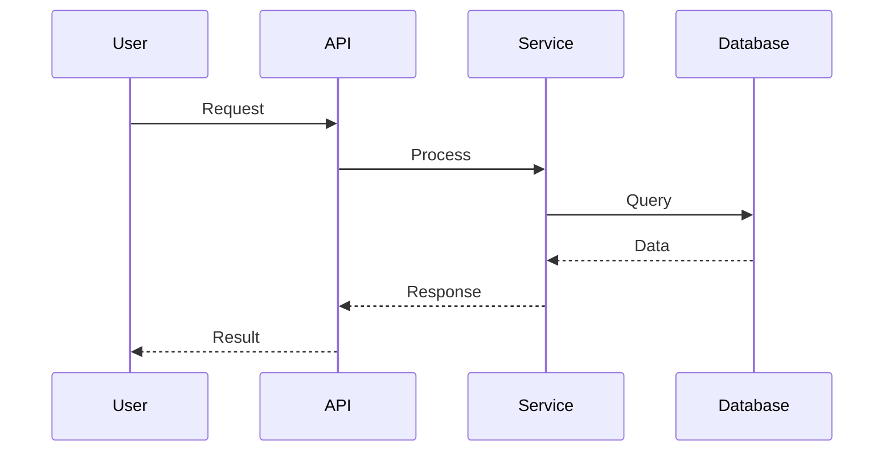

# Generating a Technical Design Document

**🔑 KISS Principle: Keep It Stupid Simple**
All solutions must follow the KISS principle - favor simplicity over complexity.

Create a comprehensive Technical Design Document in Markdown format that details the technical implementation approach, system architecture, and design decisions for a feature. This document should complement the Product Requirements Document (PRD) by focusing on the "how" rather than the "what".

## Process
1. **Receive PRD Reference**: The user points the AI to a specific PRD file for the feature requiring technical design or ask the user to provide feature description.
2. **Extract Jira ID:** Extract the Jira task ID from the PRD filename or folder name. If not found, ask the user for the Jira task ID.
3. **Analyze PRD:** The AI reads and analyzes the functional requirements or user description, non-functional requirements, user stories, and business objectives from the specified PRD to understand WHAT needs to be built.
4. **Ask Technical Clarifying Questions:** Before writing the technical design, the AI *must* ask clarifying questions to understand technical requirements, constraints, and implementation preferences to determine HOW it should be built.
5. **Generate Technical Design:** Based on the PRD analysis and technical answers, generate a comprehensive technical design document using the structure outlined below.
6. **Create/Use Feature Folder & Save:** Save the document as `[YYYY-MM-DD]-[JIRA-ID]-[feature-name]-tech-design.md` in the same folder as the PRD: `/tasks/[JIRA-ID]-[feature-name]/`.

## Clarifying Questions (Examples)
The AI should adapt its questions based on the feature, but here are common technical areas to explore:
- **Architecture Pattern:** "What architectural pattern should this follow? (e.g., MVC, microservices, event-driven)" *Note: System must adhere to **Clean Architecture** principles*
- **Technology Stack:** "Are there specific technologies, frameworks, or libraries that must be used?"
- **Integration Points:** "What existing systems, APIs, or services will this feature need to integrate with?"
- **Data Storage:** "What are the data storage requirements? (database type, schema considerations, data volume)"
- **Performance Constraints:** "Are there specific performance requirements? (response times, throughput, scalability needs)"
- **External Dependencies:** "Does this feature depend on any external services or third-party APIs?"
- **Monitoring & Observability:** "What monitoring, logging, or observability requirements exist?"
- **Data Flow:** "Can you describe how data flows through the system for this feature?"
- **State Management:** "How should state be managed? (stateless, caching strategies, persistence needs)"
- **Error Handling:** "What error handling and recovery strategies should be implemented?"

## Technical Design Structure
The generated technical design should include the following sections:

1. **High-Level Architecture:** 
   - System overview with **Clean Architecture** layers and architectural diagram
   - Component relationships and data flow following dependency inversion principles
   - Integration points with existing systems
   - Clear separation of domain, application, and infrastructure concerns

2. **Detailed Design:**
   
   a) **System Components**
   For each major component, describe:
   - **Responsibilities**: What the component does in the system

   b) **Sequence Diagrams**
   - Step-by-step call sequences between components
   - Async processes and distributed system interactions
   - Critical user flows and system workflows

   c) **State Management**
   - Caching strategies and cache invalidation if aplicable
   - Data persistence mechanisms if aplicable
   - Consistency guarantees and transaction handling

3. **API Design:**
   - Endpoint specifications with HTTP methods
   - Request/response formats and data contracts
   - Authentication and authorization mechanisms
   - Error response formats and status codes

4. **Data Considerations:**
   - Database schema design and relationships
   - Data migration strategies (if applicable)
   - Data validation and business rules

5. **Performance, Scalability, and Reliability:**
   - Performance optimization strategies
   - Scalability considerations and bottleneck analysis
   - Reliability patterns (circuit breakers, retries, timeouts)
   - Monitoring and alerting strategies

6. **Open Questions:**
   - Technical uncertainties requiring further investigation
   - Implementation alternatives to be decided
   - Architecture decisions requiring team input

## Target Audience
The primary readers of the Technical Design Document include:
- **junior Software Engineers**: Understanding implementation approach and architecture
- **Technical Leads**: Reviewing design decisions and technical feasibility
- **QA Engineers**: Understanding system behavior for integration testing

The document should be technical enough for implementation guidance while remaining accessible to technical stakeholders for review and validation.

## Technical Design Output
- **Format:** Markdown (`.md`)
- **Location:** `/tasks/[JIRA-ID]-[feature-name]/`
- **Filename:** `[YYYY-MM-DD]-[JIRA-ID]-[feature-name]-tech-design.md`
- **Style:** Try and keep to 80 character row length. Trim empty characters in line ends. VERY IMPORTANT: Always end files with an empty line.
- **Header:** Start file with a Markdown header:

```markdown
# [feature-name] - Technical Design Document

## Reference Documents
- **Product Requirements Document**: [Link to corresponding PRD file]
- **Related Technical Dependencies**: [Links to other technical design documents if applicable]

## High-Level Architecture

### System Overview
[Brief description of the overall technical approach following **Clean Architecture** principles]

### Architecture Diagram - Clean Architecture
```mermaid
classDef appLayer fill:#d4edda,stroke:#155724,stroke-width:2px,color:#000
classDef apiLayer fill:#d1ecf1,stroke:#0c5460,stroke-width:2px,color:#000
classDef infraLayer fill:#fff3cd,stroke:#856404,stroke-width:2px,color:#000
classDef external fill:#f8d7da,stroke:#721c24,stroke-width:2px,color:#000

graph TD
    A[Infrastructure Layer]:::infraLayer --> B[Application Layer]:::apiLayer
    B --> C[Domain Layer - Core]:::appLayer
    
    A1[Controllers/API]:::apiLayer --> B
    A2[Database/External APIs]:::external --> B
    A3[Message Queues]:::external --> B
    
    B1[Handlers]:::apiLayer --> C
    B2[Application Services]:::apiLayer --> C
    
    C1[Domain Entities]:::appLayer
    C2[Domain Services]:::appLayer 
    C3[Business Rules]:::appLayer
    
    subgraph "Domain Core"
    C1
    C2
    C3
    end
```

### Integration Points
- **[System/Service 1]**: [Description of integration]
- **[System/Service 2]**: [Description of integration]

## Detailed Design
### Sequence Diagrams

#### [Critical Flow 1]


#### [Critical Flow 2]
[Another sequence diagram for key workflows]

### System Components

#### [Component 1 Name]
**Responsibilities:**
- [Primary responsibility 1]
- [Primary responsibility 2]


#### [Component 2 Name]
[Similar structure as Component 1]


### State Management

**Caching Strategy:**
- **[Cache Type 1]**: [What is cached, TTL, invalidation strategy]
- **[Cache Type 2]**: [What is cached, TTL, invalidation strategy]

**Data Persistence:**
- **[Data Type 1]**: [Storage mechanism, consistency requirements]
- **[Data Type 2]**: [Storage mechanism, consistency requirements]

**Consistency Guarantees:**
- [Description of consistency model and trade-offs]

## API Design

### Endpoints

#### [Endpoint 1]
- **Method:** [GET/POST/PUT/DELETE]
- **Path:** [/api/resource/{id}]
- **Description:** [What this endpoint does]
- **Request:**
```json
{
  "field1": "value",
  "field2": "value"
}
```
- **Response:**
```json
{
  "id": "123",
  "result": "success",
  "data": {}
}
```

#### [Endpoint 2]
[Similar structure for other endpoints]

### Authentication & Authorization
- **Authentication:** [Method - JWT, OAuth, API keys, etc.]
- **Authorization:** [RBAC, permissions, access control strategy]

### Error Handling
- **Error Format:**
```json
{
  "error": "error_code",
  "message": "Human readable message",
  "details": {}
}
```
- **HTTP Status Codes:** [List of used status codes and their meanings]

## Data Considerations

### Database Schema
```sql
-- [Table/Collection 1]
CREATE TABLE [table_name] (
  id PRIMARY KEY,
  field1 VARCHAR(255),
  field2 INTEGER,
  created_at TIMESTAMP
);
```

### Data Relationships
- **[Entity 1]** → **[Entity 2]**: [Relationship type and description]
- **[Entity 2]** → **[Entity 3]**: [Relationship type and description]

### Data Migration
- **Migration Strategy:** [If applicable - how to migrate existing data]
- **Rollback Plan:** [How to rollback if migration fails]

### Data Validation
- **Business Rules:** [Key validation rules and constraints]
- **Data Integrity:** [Referential integrity and consistency checks]

## Performance, Scalability, and Reliability

### Performance Optimization
- **Database:** [Indexing strategy, query optimization]
- **Caching:** [Caching layers and strategies]
- **API:** [Response time targets and optimization techniques]

### Scalability Considerations
- **Horizontal Scaling:** [How components can scale out]
- **Vertical Scaling:** [Resource scaling requirements]
- **Bottleneck Analysis:** [Identified bottlenecks and mitigation]

### Reliability Patterns
- **Circuit Breakers:** [Where and how implemented]
- **Retries:** [Retry policies for external dependencies]
- **Timeouts:** [Timeout configurations for operations]
- **Health Checks:** [Health monitoring and readiness probes]

### Monitoring & Observability
- **Metrics:** [Key metrics to track]
- **Logging:** [Logging strategy and important log events]
- **Tracing:** [Distributed tracing for complex flows]

## Open Questions
- [Technical question 1 requiring further investigation]
- [Technical question 2 requiring team decision]
- [Architecture decision 3 with alternatives to evaluate]
```

## Final Instructions
1. Do NOT start implementing the technical design
2. Always reference (if exists) and analyze the provided PRD document first to understand business requirements
3. Ask technical clarifying questions to understand implementation requirements and constraints
4. Focus on technical architecture and implementation details, complementing (not duplicating) the PRD
5. Include detailed technical specifications sufficient for implementation guidance
6. Consider integration with existing systems and technical constraints
7. Provide multiple implementation alternatives when appropriate
8. Ensure the technical design directly addresses the functional and non-functional requirements from the PRD
9. Create clear links back to the PRD document in the Reference Documents section