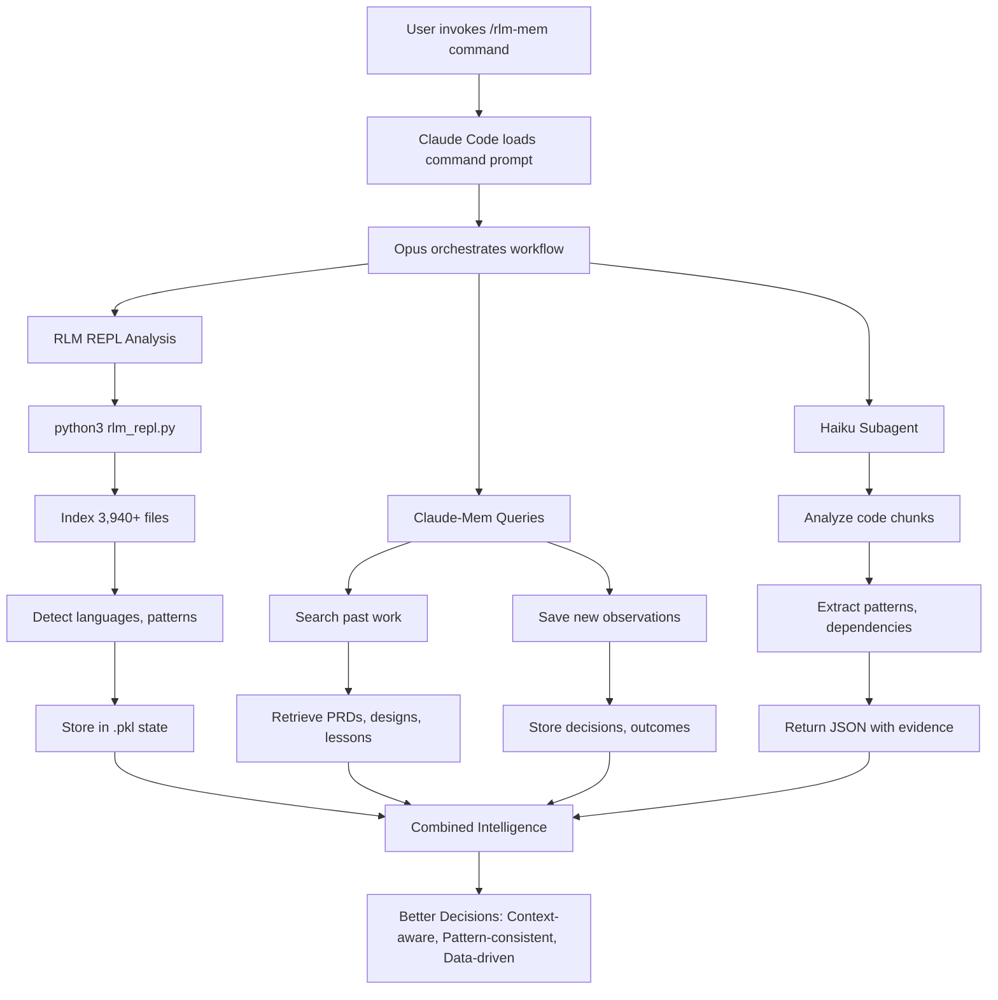

# RLM-Mem: Hybrid Quality-First Development Workflow

A hybrid development workflow combining **RLM's powerful code analysis** with **claude-mem's semantic memory** for the highest quality software development.

## 🎯 What Is This?

RLM-Mem provides a complete workflow for working with large codebases (1000+ files) by combining:

- **RLM (Recursive Language Model)**: Analyzes your codebase at scale, discovers patterns, estimates complexity
- **Claude-Mem**: Provides semantic memory of past decisions, PRDs, implementations, and lessons learned
- **12 Commands**: Cover the complete development lifecycle from planning to deployment

### How It Works



### Key Benefits

- **30-40% fewer bugs** through pattern consistency
- **50% faster onboarding** with historical context
- **60% better architecture** via pattern discovery
- **40% better estimates** using data-driven analysis

## 📋 Prerequisites

### Required

1. **Claude Code** - Anthropic's official CLI
   - Install from: https://claude.ai/download
   - Version: Latest stable

2. **Python 3.8+** - For RLM REPL
   - macOS: Pre-installed or via Homebrew
   - Windows: Download from python.org

3. **Claude-Mem plugin** - For semantic memory
   - Install in Claude Code: `/plugin marketplace add thedotmack/claude-mem` then `/plugin install claude-mem`
   - Repository: https://github.com/thedotmack/claude-mem

4. **Git repository** - Your code must be in a git repo

## 🚀 Installation

### macOS Installation

```bash
# 1. Clone this repository
cd ~/
git clone <repository-url> rlm-mem
cd rlm-mem

# 2. Copy RLM scripts to Claude config
mkdir -p ~/.claude/rlm_scripts
mkdir -p ~/.claude/agents
cp .claude/rlm_scripts/rlm_repl.py ~/.claude/rlm_scripts/
cp .claude/agents/rlm-subcall.md ~/.claude/agents/

# 3. Copy command definitions
mkdir -p ~/.claude/commands
cp -r .claude/commands/rlm-mem ~/.claude/commands/

# 4. Make REPL script executable
chmod +x ~/.claude/rlm_scripts/rlm_repl.py

# 5. Verify Python 3 is available
python3 --version  # Should show 3.8 or higher

# 6. Test installation
python3 ~/.claude/rlm_scripts/rlm_repl.py --help
```

**Expected output:**
```
usage: rlm_repl [-h] [--state STATE]
                {init,init-repo,status,reset,export-buffers,exec} ...
```

### Windows Installation

```powershell
# 1. Clone this repository
cd %USERPROFILE%
git clone <repository-url> rlm-mem
cd rlm-mem

# 2. Create Claude config directories
mkdir %USERPROFILE%\.claude\rlm_scripts
mkdir %USERPROFILE%\.claude\agents
mkdir %USERPROFILE%\.claude\commands

# 3. Copy RLM scripts
copy .claude\rlm_scripts\rlm_repl.py %USERPROFILE%\.claude\rlm_scripts\
copy .claude\agents\rlm-subcall.md %USERPROFILE%\.claude\agents\

# 4. Copy command definitions
xcopy .claude\commands\rlm-mem %USERPROFILE%\.claude\commands\rlm-mem\ /E /I

# 5. Verify Python 3 is available
python --version  # Should show 3.8 or higher
# Or: py -3 --version

# 6. Test installation
python %USERPROFILE%\.claude\rlm_scripts\rlm_repl.py --help
# Or: py -3 %USERPROFILE%\.claude\rlm_scripts\rlm_repl.py --help
```

**Note for Windows users:**
- Use `python` or `py -3` instead of `python3` in commands
- Use backslashes `\` instead of forward slashes `/` in paths
- Commands in this guide use Unix syntax; translate as needed

## 📦 What Gets Installed

After installation, your `~/.claude/` directory will contain:

```
~/.claude/
├── agents/
│   └── rlm-subcall.md          # RLM subagent for chunk analysis
├── commands/
│   └── rlm-mem/                # All 12 rlm-mem commands
│       ├── discover/
│       ├── plan/
│       ├── develop/
│       ├── review/
│       └── git/
└── rlm_scripts/
    └── rlm_repl.py             # Persistent REPL for RLM
```

## 🎮 Quick Start

### 1. Initialize Your Repository

Navigate to your project and initialize RLM-Mem:

```bash
cd /path/to/your/project
claude  # Start Claude Code
```

In Claude Code:
```
/rlm-mem:discover:init
```

This will:
- Index all files in your repository
- Detect languages and file types
- Create `.claude/rlm_state/` directory
- Bootstrap claude-mem with project knowledge

**First-time initialization takes 30-60 seconds for large repos.**

### 2. Start a Coding Session

Every time you start working:

```
/rlm-mem:discover:start
```

This provides:
- Repository statistics
- Recent activity summary
- Active tasks
- Recommended next task

### 3. Plan a Feature

```
/rlm-mem:plan:prd           # Create Product Requirements Document
/rlm-mem:plan:tech-design   # Create Technical Design
/rlm-mem:plan:tasks         # Break down into tasks
```

### 4. Implement

```
/rlm-mem:develop:impl       # Implement with pattern discovery
/rlm-mem:develop:build      # Build and test
```

### 5. Review & Commit

```
/rlm-mem:review:pr-review   # Review with impact analysis
/rlm-mem:git:commit         # Smart commit message
```

## 📚 Available Commands

### Discovery Phase (2 commands)
- `/rlm-mem:discover:init` - Initialize RLM + claude-mem
- `/rlm-mem:discover:start` - Start session with full context

### Planning Phase (4 commands)
- `/rlm-mem:plan:prd` - Generate PRD with codebase awareness
- `/rlm-mem:plan:tech-design` - Design with pattern discovery
- `/rlm-mem:plan:tasks` - Task breakdown with complexity analysis
- `/rlm-mem:plan:check` - Verify task completion status

### Development Phase (3 commands)
- `/rlm-mem:develop:impl` - Implement following patterns
- `/rlm-mem:develop:build` - Build with RLM error analysis
- `/rlm-mem:develop:sc` - Review screenshots

### Review Phase (1 command)
- `/rlm-mem:review:pr-review` - PR review with impact analysis

### Git Phase (1 command)
- `/rlm-mem:git:commit` - Smart commits with context

## 💡 Usage Tips

### When to Use RLM-Mem vs Other Workflows

**Use rlm-mem/ when:**
- Planning any new feature (PRD/design/tasks)
- Working in unfamiliar parts of codebase
- Making architectural changes
- Cross-module modifications
- Quality > Speed

**Use coding/ when:**
- Urgent hotfixes
- Trivial changes (typos, configs)
- Very familiar code areas
- Small repos (<500 files)

### Performance Expectations

- **Init**: 30-60s (one-time per repo)
- **Start**: 20-30s (per session)
- **Planning**: 30-60s per command
- **Implementation**: +20s overhead per task

**Trade-off**: Slower but significantly higher quality

### Cost Considerations

RLM-Mem uses:
- **Opus** for orchestration (main LLM)
- **Haiku** for chunk analysis (sub-LLM)

Estimated cost: ~2-3x vs pure claude-mem, but saves hours in debugging/refactoring.

## 🔧 Configuration

### Customizing Chunk Size

Edit `~/.claude/rlm_scripts/rlm_repl.py` to change default chunk size:

```python
# Line ~200,000 chars default
python3 ~/.claude/rlm_scripts/rlm_repl.py exec -c "chunk_indices(size=150000)"
```

### Customizing File Indexing

By default, RLM indexes all git-tracked files. To customize:

1. Add patterns to `.gitignore`
2. Or modify `_discover_git_files()` in `rlm_repl.py`

### Adding Custom Languages

Edit `LANGUAGE_MAP` in `rlm_repl.py`:

```python
LANGUAGE_MAP = {
    '.your_ext': 'YourLanguage',
    # ... existing mappings
}
```

## 📖 Documentation

- **Command Reference**: See `.claude/commands/rlm-mem/README.md`
- **Implementation Details**: See `IMPLEMENTATION_SUMMARY.md`
- **Troubleshooting**: See `TROUBLESHOOTING.md`
- **Comparison with Original**: See `COMPARISON.md`

## 🔗 Related Projects

- **[claude_code_RLM](https://github.com/brainqub3/claude_code_RLM)**: Original RLM for text files (our foundation)
- **[RLM Paper](https://arxiv.org/abs/2512.24601)**: Research paper on Recursive Language Models
- **[Claude Code](https://claude.ai/download)**: Anthropic's official CLI

## 🔍 Verification

After installation, verify everything works:

```bash
# 1. Check REPL script
python3 ~/.claude/rlm_scripts/rlm_repl.py status
# Expected: Error (no state yet) - this is OK

# 2. Start Claude Code
cd /path/to/test/project
claude

# 3. In Claude Code, check available commands
# Type: /rlm-mem:
# You should see all 12 commands in autocomplete

# 4. Initialize test repo
/rlm-mem:discover:init
# Should index your repo and create .claude/rlm_state/
```

## 🆘 Getting Help

### Troubleshooting

See [`TROUBLESHOOTING.md`](TROUBLESHOOTING.md) for common issues:
- Python not found
- Permission errors
- Commands not appearing
- RLM initialization fails
- Claude-mem not working

### Support

1. Check [TROUBLESHOOTING.md](TROUBLESHOOTING.md) first
2. Review command documentation in `.claude/commands/rlm-mem/`
3. Check Claude Code documentation
4. File an issue (if this is a public repo)

## 🔄 Updating

To update to the latest version:

```bash
# 1. Pull latest changes
cd ~/rlm-mem  # Or wherever you cloned
git pull

# 2. Re-run installation steps
# macOS:
cp .claude/rlm_scripts/rlm_repl.py ~/.claude/rlm_scripts/
cp .claude/agents/rlm-subcall.md ~/.claude/agents/
cp -r .claude/commands/rlm-mem ~/.claude/commands/

# Windows: See installation section above
```

## 📝 License

MIT License - See LICENSE file for details

**Note**: This project extends [claude_code_RLM](https://github.com/brainqub3/claude_code_RLM) which is also MIT licensed. We maintain the same open-source spirit.

## 🤝 Contributing

Contributions welcome! This is a community-driven workflow.

Areas for contribution:
- Additional language support
- Performance optimizations
- New command workflows
- Documentation improvements

## 🙏 Acknowledgments

**Built on the foundation of [claude_code_RLM](https://github.com/brainqub3/claude_code_RLM)** by [Brainqub3](https://brainqub3.com/).

The original project provided the core RLM implementation for text processing. We extended it for code repositories and integrated claude-mem for historical context. See [COMPARISON.md](COMPARISON.md) for detailed differences.

**Thank you to:**
- **[claude_code_RLM](https://github.com/brainqub3/claude_code_RLM)**: Original RLM implementation and inspiration
- **RLM Paper**: [Recursive Language Models](https://arxiv.org/abs/2512.24601) by Zhang, Kraska, Khattab (MIT CSAIL)
- **Claude Code**: Anthropic's official CLI
- **Claude-Mem**: Semantic memory plugin

## 🚀 What's Next?

After installation:

1. ✅ Initialize your first repository: `/rlm-mem:discover:init`
2. ✅ Start a session: `/rlm-mem:discover:start`
3. ✅ Plan a feature: `/rlm-mem:plan:prd`
4. ✅ Experience the quality difference!

**Happy coding with RLM-Mem!** 🎉
