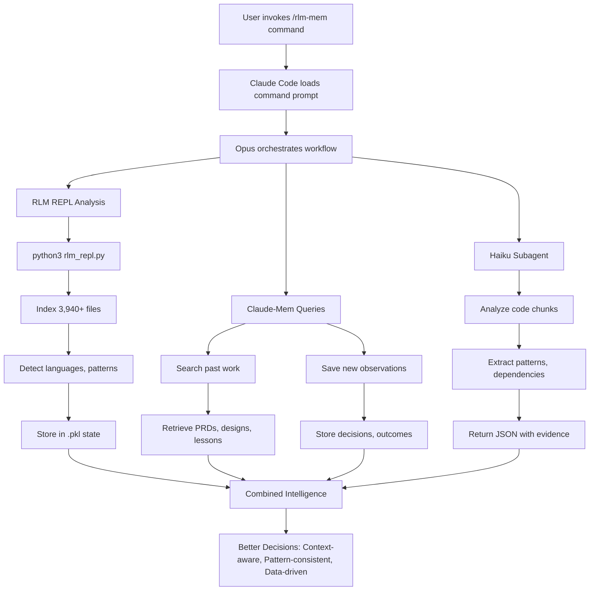

# RLM-Mem: Hybrid Quality-First Development Workflow

A hybrid development workflow combining **RLM's powerful code analysis** with **claude-mem's semantic memory** for the highest quality software development.

## 🎯 What Is This?

RLM-Mem provides a complete workflow for working with large codebases (1000+ files) by combining:

- **RLM (Recursive Language Model)**: Analyzes your codebase at scale, discovers patterns, estimates complexity
- **Claude-Mem**: Provides semantic memory of past decisions, PRDs, implementations, and lessons learned
- **12 Commands**: Cover the complete development lifecycle from planning to deployment

### How It Works


```mermaid
graph TD
    A[User invokes /rlm-mem command] --> B[Claude Code loads command prompt]
    B --> C[Opus orchestrates workflow]

    C --> D[RLM REPL Analysis]
    C --> E[Claude-Mem Queries]
    C --> F[Haiku Subagent]

    D --> G[python3 rlm_repl.py]
    G --> H[Index 3,940+ files]
    H --> I[Detect languages, patterns]
    I --> J[Store in .pkl state]

    E --> K[Search past work]
    E --> L[Save new observations]
    K --> M[Retrieve PRDs, designs, lessons]
    L --> N[Store decisions, outcomes]

    F --> O[Analyze code chunks]
    O --> P[Extract patterns, dependencies]
    P --> Q[Return JSON with evidence]

    J --> R[Combined Intelligence]
    M --> R
    N --> R
    Q --> R

    R --> S[Better Decisions: Context-aware, Pattern-consistent, Data-driven]
```

### Key Benefits

- **30-40% fewer bugs** through pattern consistency
- **50% faster onboarding** with historical context
- **60% better architecture** via pattern discovery
- **40% better estimates** using data-driven analysis

## 📋 Prerequisites

### Required

1. **Claude Code** - Anthropic's official CLI
   - Install from: https://claude.ai/download
   - Version: Latest stable

2. **Python 3.8+** - For RLM REPL
   - macOS: Pre-installed or via Homebrew
   - Windows: Download from python.org

3. **Claude-Mem plugin** - For semantic memory
   - Install in Claude Code: `/plugin marketplace add thedotmack/claude-mem` then `/plugin install claude-mem`
   - Repository: https://github.com/thedotmack/claude-mem

4. **Git repository** - Your code must be in a git repo

### Nice to Have

5. **Frontend Design Plugin** - For UI/UX design work
   - Install: `/plugin marketplace add anthropics/claude-code` then `/plugin install frontend-design@claude-code-plugins`

6. **Context7 MCP Server** - For library documentation lookups (no authentication required)
   - Per-project: `claude mcp add --transport http context7 https://mcp.context7.com/mcp`
   - All projects: `claude mcp add --transport http --scope user context7 https://mcp.context7.com/mcp`

## 🚀 Installation

### macOS Installation

```bash
# 1. Clone this repository
cd ~/
git clone <repository-url> rlm-mem
cd rlm-mem

# 2. Run the install script (recommended)
bash install.sh

# Or manually copy files:
mkdir -p ~/.claude/rlm_scripts ~/.claude/agents ~/.claude/commands ~/.claude/hooks
cp .claude/rlm_scripts/rlm_repl.py ~/.claude/rlm_scripts/
cp .claude/agents/rlm-subcall.md ~/.claude/agents/
# test subagents (optional but recommended):
cp .claude/agents/test-*.md ~/.claude/agents/
cp -r .claude/commands/rlm-mem ~/.claude/commands/
# context guard hook (optional):
cp .claude/hooks/context-guard.sh ~/.claude/hooks/
chmod +x ~/.claude/hooks/context-guard.sh

# 3. Make REPL script executable
chmod +x ~/.claude/rlm_scripts/rlm_repl.py

# 4. Verify Python 3 is available
python3 --version  # Should show 3.8 or higher

# 5. Test installation
python3 ~/.claude/rlm_scripts/rlm_repl.py --help
```

`install.sh` copies all files automatically. Run it again after
pulling updates.

**Expected output:**
```
usage: rlm_repl [-h] [--state STATE]
                {init,init-repo,status,reset,export-buffers,exec} ...
```

### Windows Installation

```powershell
# 1. Clone this repository
cd %USERPROFILE%
git clone <repository-url> rlm-mem
cd rlm-mem

# 2. Create Claude config directories
mkdir %USERPROFILE%\.claude\rlm_scripts
mkdir %USERPROFILE%\.claude\agents
mkdir %USERPROFILE%\.claude\commands

# 3. Copy RLM scripts
copy .claude\rlm_scripts\rlm_repl.py %USERPROFILE%\.claude\rlm_scripts\
copy .claude\agents\rlm-subcall.md %USERPROFILE%\.claude\agents\

# 4. Copy test subagents (optional but recommended)
for %f in (.claude\agents\test-*.md) do copy "%f" %USERPROFILE%\.claude\agents\

# 5. Copy command definitions
xcopy .claude\commands\rlm-mem %USERPROFILE%\.claude\commands\rlm-mem\ /E /I

# 6. Verify Python 3 is available
python --version  # Should show 3.8 or higher
# Or: py -3 --version

# 6. Test installation
python %USERPROFILE%\.claude\rlm_scripts\rlm_repl.py --help
# Or: py -3 %USERPROFILE%\.claude\rlm_scripts\rlm_repl.py --help
```

**Note for Windows users:**
- Use `python` or `py -3` instead of `python3` in commands
- Use backslashes `\` instead of forward slashes `/` in paths
- Commands in this guide use Unix syntax; translate as needed

## 📦 What Gets Installed

After installation, your `~/.claude/` directory will contain:

```
~/.claude/
├── agents/
│   ├── rlm-subcall.md          # RLM subagent for chunk analysis
│   ├── test-backend.md         # Backend test writer (pytest/vitest/jest/etc.)
│   ├── test-review.md          # Adversarial coverage gap analyzer
│   ├── test-e2e-planner.md     # E2E test plan generator (requires Playwright MCP)
│   ├── test-e2e-generator.md   # Playwright test code generator (requires Playwright MCP)
│   └── test-e2e-healer.md      # Failing test debugger/repair (requires Playwright MCP)
├── commands/
│   └── rlm-mem/                # All 13 rlm-mem commands
│       ├── discover/
│       ├── plan/
│       ├── develop/            # impl, build, sc, save
│       ├── review/
│       └── git/
├── hooks/
│   └── context-guard.sh        # Context window warning hook (optional)
└── rlm_scripts/
    └── rlm_repl.py             # Persistent REPL for RLM
```

## 🎮 Quick Start

### 1. Initialize Your Repository

Navigate to your project and initialize RLM-Mem:

```bash
cd /path/to/your/project
claude  # Start Claude Code
```

In Claude Code:
```
/rlm-mem:discover:init
```

This will:
- Index all files in your repository
- Detect languages and file types
- Create `.claude/rlm_state/` directory
- Bootstrap claude-mem with project knowledge

**First-time initialization takes 30-60 seconds for large repos.**

### 2. Start a Coding Session

Every time you start working:

```
/rlm-mem:discover:start
```

This provides:
- Repository statistics
- Recent activity summary
- Active tasks
- Recommended next task

### 3. Plan a Feature

```
/rlm-mem:plan:prd           # Create Product Requirements Document
/rlm-mem:plan:tech-design   # Create Technical Design
/rlm-mem:plan:tasks         # Break down into tasks
```

### 4. Implement

```
/rlm-mem:develop:impl       # Implement with pattern discovery
/rlm-mem:develop:build      # Build and test
```

### 5. Review & Commit

```
/rlm-mem:review:pr-review   # Review with impact analysis
/rlm-mem:git:commit         # Smart commit message
```

## 📚 Available Commands

### Discovery Phase (2 commands)
- `/rlm-mem:discover:init` - Initialize RLM + claude-mem
- `/rlm-mem:discover:start` - Start session with full context

### Planning Phase (4 commands)
- `/rlm-mem:plan:prd` - Generate PRD with codebase awareness
- `/rlm-mem:plan:tech-design` - Design with pattern discovery
- `/rlm-mem:plan:tasks` - Task breakdown with complexity analysis
- `/rlm-mem:plan:check` - Verify task completion status

### Development Phase (4 commands)
- `/rlm-mem:develop:impl` - Implement following patterns
- `/rlm-mem:develop:build` - Build with RLM error analysis
- `/rlm-mem:develop:sc` - Review screenshots
- `/rlm-mem:develop:save` - Wrap up session, save to claude-mem

### Review Phase (1 command)
- `/rlm-mem:review:pr-review` - PR review with impact analysis

### Git Phase (1 command)
- `/rlm-mem:git:commit` - Smart commits with context

## 🧪 Test Subagents

RLM-Mem ships five specialized test subagents that run in isolated contexts to prevent implementation bias. Invoke them via the `Task` tool from within `/rlm-mem:develop:impl`.

### Agents Overview

| Agent | Model | Purpose | Requires |
|-------|-------|---------|----------|
| `test-backend` | Haiku | Write & run unit/integration tests. Auto-detects pytest, vitest, jest, go test, cargo test, phpunit. | Test framework in project |
| `test-review` | Sonnet | Adversarial gap analysis — finds what tests missed. Does NOT write tests. | Nothing extra |
| `test-e2e-planner` | Sonnet | Explore live app and produce a markdown test plan. | Playwright MCP server |
| `test-e2e-generator` | Sonnet | Convert test plan into executable `.spec.ts` files, verifying selectors live. | Playwright MCP server |
| `test-e2e-healer` | Sonnet | Debug and repair failing Playwright tests. Patches selectors, timing, and data issues. | Playwright MCP server |

### When to Use Each Agent

- **After backend changes**: run `test-backend` then `test-review`
- **After frontend changes**: run `test-e2e-planner` → `test-e2e-generator` → `test-e2e-healer` (if failures)
- **After any change**: run `test-review` last — it finds gaps the other agents missed

### Playwright MCP Setup (for E2E agents)

Add the Playwright MCP server to your global Claude config (`~/.claude/mcp.json`):

```json
{
  "mcpServers": {
    "playwright-test": {
      "command": "npx",
      "args": ["@playwright/mcp@latest"]
    }
  }
}
```

### Updating Playwright Forks

The E2E agents (`test-e2e-planner`, `test-e2e-generator`, `test-e2e-healer`) are forks of Playwright's official agents. Each file contains an `UPSTREAM SOURCE` header with the source URL and fetch date.

To update a Playwright fork when Playwright releases a new version:

```bash
# 1. Download the latest upstream agent
curl -o /tmp/playwright-test-planner.agent.md \
  https://raw.githubusercontent.com/microsoft/playwright/main/packages/playwright/src/agents/playwright-test-planner.agent.md

# 2. Diff against your local copy
diff /tmp/playwright-test-planner.agent.md \
  ~/.claude/agents/test-e2e-planner.md

# 3. Apply upstream changes manually, preserving lines marked # CUSTOM
# Lines between <!-- # CUSTOM --> and <!-- # END CUSTOM --> are local additions
# — keep them when merging upstream changes

# 4. Update the fetched date in the UPSTREAM SOURCE header:
# <!-- fetched: YYYY-MM-DD -->

# 5. Copy updated file back to installation
cp .claude/agents/test-e2e-planner.md ~/.claude/agents/
```

Repeat for `test-e2e-generator.md` and `test-e2e-healer.md`.

## 💡 Usage Tips

### Command Tree Overview

Four command trees are available after installation. Use the right one for the job:

| Tree | Memory | Code Analysis | Use When |
|------|--------|---------------|----------|
| `/rlm-mem` | claude-mem | RLM | **Recommended default.** Quality-first. Full history + codebase intelligence. |
| `/rlm` | None | RLM | No prior session history yet, or one-off large-codebase analysis. |
| `/coding` | claude-mem | None | Fast work on familiar code. Lightweight — no RLM overhead. |
| `/dev` | `ai-docs/` files | None | **Deprecated.** Context stored as checked-in markdown files instead of claude-mem. Poor memory management — files go stale, require manual maintenance. |

> **`/dev` is deprecated.** It stores project context in an `ai-docs/` directory of markdown files that must be manually kept up to date. `/coding` replaces it with claude-mem — zero maintenance, semantic search, persistent across sessions.

### When to Use Each Tree

**Use `/rlm-mem` when:**
- Planning any new feature (PRD/design/tasks)
- Working in unfamiliar parts of codebase
- Making architectural changes
- Cross-module modifications
- Quality > Speed

**Use `/coding` when:**
- Urgent hotfixes
- Trivial changes (typos, configs)
- Very familiar code areas
- Small repos (<500 files)

**Use `/rlm` when:**
- First session on a new large codebase (no claude-mem history yet)
- One-off analysis task where you don't need persistent memory

**Avoid `/dev`** — use `/coding` instead.

### Recommended Allowlist

`/start` is designed to need minimal shell permissions. To make
session startup fully frictionless (zero permission prompts),
add these to your Claude Code allow-list in settings:

```
python3 ~/.claude/rlm_scripts/rlm_repl.py *
git log *
git diff *
```

On macOS/Linux: Claude Code settings → Permissions → Add allowed
commands. On Windows, use the equivalent paths with backslashes.

Once configured, `/rlm-mem:discover:start` runs without any
interruptions.

### Context Guard Hook (Optional)

The Context Guard is a `UserPromptSubmit` hook that blocks new
development work when your context window is too full to complete
it safely.

**Install:**

```bash
cp .claude/hooks/context-guard.sh ~/.claude/hooks/
```

**Register in `~/.claude/settings.json`:**

```json
{
  "hooks": {
    "UserPromptSubmit": [
      {
        "hooks": [
          {
            "type": "command",
            "command": "bash ~/.claude/hooks/context-guard.sh"
          }
        ]
      }
    ]
  }
}
```

**How it works:** When context usage reaches the threshold, any
prompt containing development keywords (`implement`, `build`,
`create`, `refactor`, etc.) triggers a warning injected into
Claude's context. You can still proceed — the warning is
informational, not a hard block. Docs updates, task list changes,
commits, and `/check` always pass through silently.

**Configure threshold** (default 85%):

```bash
export CONTEXT_GUARD_THRESHOLD=70  # warn earlier
```

### Performance Expectations

- **Init**: 30-60s (one-time per repo)
- **Start**: 20-30s (per session, zero prompts with allowlist)
- **Planning**: 30-60s per command
- **Implementation**: +20s overhead per task

**Trade-off**: Slower but significantly higher quality

### Cost Considerations

RLM-Mem uses:
- **Opus** for orchestration (main LLM)
- **Haiku** for chunk analysis (sub-LLM)

Estimated cost: ~2-3x vs pure claude-mem, but saves hours in debugging/refactoring.

## 🔧 Configuration

### Customizing Chunk Size

Edit `~/.claude/rlm_scripts/rlm_repl.py` to change default chunk size:

```python
# Line ~200,000 chars default
python3 ~/.claude/rlm_scripts/rlm_repl.py exec -c "chunk_indices(size=150000)"
```

### Customizing File Indexing

By default, RLM indexes all git-tracked files. To customize:

1. Add patterns to `.gitignore`
2. Or modify `_discover_git_files()` in `rlm_repl.py`

### Adding Custom Languages

Edit `LANGUAGE_MAP` in `rlm_repl.py`:

```python
LANGUAGE_MAP = {
    '.your_ext': 'YourLanguage',
    # ... existing mappings
}
```

## 📖 Documentation

- **Command Reference**: See `.claude/commands/rlm-mem/README.md`
- **Implementation Details**: See `IMPLEMENTATION_SUMMARY.md`
- **Troubleshooting**: See `TROUBLESHOOTING.md`
- **Comparison with Original**: See `COMPARISON.md`

## 🔗 Related Projects

- **[claude_code_RLM](https://github.com/brainqub3/claude_code_RLM)**: Original RLM for text files (our foundation)
- **[RLM Paper](https://arxiv.org/abs/2512.24601)**: Research paper on Recursive Language Models
- **[Claude Code](https://claude.ai/download)**: Anthropic's official CLI

## 🔍 Verification

After installation, verify everything works:

```bash
# 1. Check REPL script
python3 ~/.claude/rlm_scripts/rlm_repl.py status
# Expected: Error (no state yet) - this is OK

# 2. Start Claude Code
cd /path/to/test/project
claude

# 3. In Claude Code, check available commands
# Type: /rlm-mem:
# You should see all 12 commands in autocomplete

# 4. Initialize test repo
/rlm-mem:discover:init
# Should index your repo and create .claude/rlm_state/
```

## 🆘 Getting Help

### Troubleshooting

See [`TROUBLESHOOTING.md`](TROUBLESHOOTING.md) for common issues:
- Python not found
- Permission errors
- Commands not appearing
- RLM initialization fails
- Claude-mem not working

### Support

1. Check [TROUBLESHOOTING.md](TROUBLESHOOTING.md) first
2. Review command documentation in `.claude/commands/rlm-mem/`
3. Check Claude Code documentation
4. File an issue (if this is a public repo)

## 🔄 Updating

To update to the latest version:

```bash
# 1. Pull latest changes
cd ~/rlm-mem  # Or wherever you cloned
git pull

# 2. Re-run installation steps
# macOS:
cp .claude/rlm_scripts/rlm_repl.py ~/.claude/rlm_scripts/
cp .claude/agents/rlm-subcall.md ~/.claude/agents/
cp -r .claude/commands/rlm-mem ~/.claude/commands/

# Windows: See installation section above
```

## 📝 License

MIT License - See LICENSE file for details

**Note**: This project extends [claude_code_RLM](https://github.com/brainqub3/claude_code_RLM) which is also MIT licensed. We maintain the same open-source spirit.

## 🤝 Contributing

Contributions welcome! This is a community-driven workflow.

Areas for contribution:
- Additional language support
- Performance optimizations
- New command workflows
- Documentation improvements

## 🙏 Acknowledgments

**Built on the foundation of [claude_code_RLM](https://github.com/brainqub3/claude_code_RLM)** by [Brainqub3](https://brainqub3.com/).

The original project provided the core RLM implementation for text processing. We extended it for code repositories and integrated claude-mem for historical context. See [COMPARISON.md](COMPARISON.md) for detailed differences.

**Thank you to:**
- **[claude_code_RLM](https://github.com/brainqub3/claude_code_RLM)**: Original RLM implementation and inspiration
- **RLM Paper**: [Recursive Language Models](https://arxiv.org/abs/2512.24601) by Zhang, Kraska, Khattab (MIT CSAIL)
- **Claude Code**: Anthropic's official CLI
- **Claude-Mem**: Semantic memory plugin

## 🚀 What's Next?

After installation:

1. ✅ Initialize your first repository: `/rlm-mem:discover:init`
2. ✅ Start a session: `/rlm-mem:discover:start`
3. ✅ Plan a feature: `/rlm-mem:plan:prd`
4. ✅ Experience the quality difference!

**Happy coding with RLM-Mem!** 🎉
