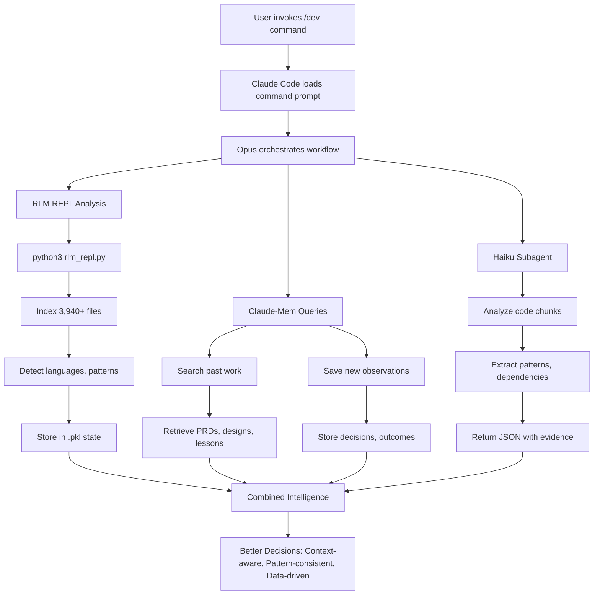

# RLM-Mem: Hybrid Quality-First Development Workflow

A hybrid development workflow combining **RLM's powerful code analysis** with **claude-mem's semantic memory** for the highest quality software development.

## 🎯 What Is This?

RLM-Mem provides a complete workflow for working with large codebases (1000+ files) by combining:

- **RLM (Recursive Language Model)**: Analyzes your codebase at scale, discovers patterns, estimates complexity
- **Claude-Mem**: Provides semantic memory of past decisions, PRDs, implementations, and lessons learned
- **10 Commands**: Cover the complete development lifecycle from planning to deployment

### How It Works


```mermaid
graph TD
    A[User invokes /dev command] --> B[Claude Code loads command prompt]
    B --> C[Opus orchestrates workflow]

    C --> D[RLM REPL Analysis]
    C --> E[Claude-Mem Queries]
    C --> F[Haiku Subagent]

    D --> G[python3 rlm_repl.py]
    G --> H[Index 3,940+ files]
    H --> I[Detect languages, patterns]
    I --> J[Store in .pkl state]

    E --> K[Search past work]
    E --> L[Save new observations]
    K --> M[Retrieve PRDs, designs, lessons]
    L --> N[Store decisions, outcomes]

    F --> O[Analyze code chunks]
    O --> P[Extract patterns, dependencies]
    P --> Q[Return JSON with evidence]

    J --> R[Combined Intelligence]
    M --> R
    N --> R
    Q --> R

    R --> S[Better Decisions: Context-aware, Pattern-consistent, Data-driven]
```

### Key Benefits

- **30-40% fewer bugs** through pattern consistency
- **50% faster onboarding** with historical context
- **60% better architecture** via pattern discovery
- **40% better estimates** using data-driven analysis

## 📋 Prerequisites

### Required

1. **Claude Code** - Anthropic's official CLI
   - Install from: https://claude.ai/download
   - Version: Latest stable

2. **Python 3.8+** - For RLM REPL
   - macOS: Pre-installed or via Homebrew
   - Windows: Download from python.org

3. **Claude-Mem plugin** - For semantic memory
   - Install in Claude Code: `/plugin marketplace add thedotmack/claude-mem` then `/plugin install claude-mem`
   - Repository: https://github.com/thedotmack/claude-mem

4. **Git repository** - Your code must be in a git repo

### Nice to Have

5. **Frontend Design Plugin** - For UI/UX design work
   - Step 1 — add to marketplace: `/plugin marketplace add anthropics/claude-code`
   - Step 2 — install: `/plugin install frontend-design@claude-code-plugins`

6. **Context7 MCP Server** - For library documentation lookups (no authentication required)
   - `claude mcp add --transport http --scope user context7 https://mcp.context7.com/mcp`

## 🚀 Installation

### macOS / Linux Installation

```bash
# 1. Clone this repository
cd ~/
git clone https://github.com/povesma/rlm-mem
cd rlm-mem

# 2. Run the install script (or follow manual steps below)
bash install.sh
```

**Or install manually:**

```bash
cd rlm-mem

# 2. Copy RLM scripts to Claude config
mkdir -p ~/.claude/rlm_scripts
mkdir -p ~/.claude/agents
cp .claude/rlm_scripts/rlm_repl.py ~/.claude/rlm_scripts/
cp .claude/agents/rlm-subcall.md ~/.claude/agents/

# 3. Copy test subagents (optional but recommended)
# test-backend and test-review work immediately
# test-e2e-* require Playwright MCP (see "Nice to Have" prerequisites)
cp .claude/agents/test-*.md ~/.claude/agents/

# 4. Copy command definitions
mkdir -p ~/.claude/commands
cp -r .claude/commands/dev ~/.claude/commands/

# 5. Make REPL script executable
chmod +x ~/.claude/rlm_scripts/rlm_repl.py

# 6. Copy hooks (optional but recommended)
mkdir -p ~/.claude/hooks
cp .claude/hooks/context-guard.sh ~/.claude/hooks/
chmod +x ~/.claude/hooks/*.sh

# 7. Set up status line (optional but recommended)
# Requires jq: brew install jq
cp .claude/statusline.sh ~/.claude/statusline.sh
chmod +x ~/.claude/statusline.sh
# Then add to ~/.claude/settings.json:
# { "statusLine": { "type": "command", "command": "~/.claude/statusline.sh" } }
# Or ask Claude: "use the existing script at ~/.claude/statusline.sh"
# (see §Statusline below for details)

# 8. Verify Python 3 is available
python3 --version  # Should show 3.8 or higher

# 9. Test installation
python3 ~/.claude/rlm_scripts/rlm_repl.py --help
```

**Upgrading from `/rlm-mem:*` commands?** Remove the old tree:
```bash
rm -rf ~/.claude/commands/rlm-mem
```

**Expected output:**
```
usage: rlm_repl [-h] [--state STATE]
                {init,init-repo,status,reset,export-buffers,exec} ...
```

### Windows Installation

```powershell
# 1. Clone this repository
cd %USERPROFILE%
git clone https://github.com/povesma/rlm-mem
cd rlm-mem

# 2. Run the install script (or follow manual steps below)
powershell -ExecutionPolicy Bypass -File install.ps1
```

**Or install manually:**

```powershell
cd rlm-mem

# 2. Create Claude config directories
mkdir %USERPROFILE%\.claude\rlm_scripts
mkdir %USERPROFILE%\.claude\agents
mkdir %USERPROFILE%\.claude\commands

# 3. Copy RLM scripts
copy .claude\rlm_scripts\rlm_repl.py %USERPROFILE%\.claude\rlm_scripts\
copy .claude\agents\rlm-subcall.md %USERPROFILE%\.claude\agents\

# 4. Copy test subagents (optional but recommended)
for %f in (.claude\agents\test-*.md) do copy "%f" %USERPROFILE%\.claude\agents\

# 5. Copy command definitions
xcopy .claude\commands\dev %USERPROFILE%\.claude\commands\dev\ /E /I

# 6. Copy hooks (optional but recommended)
mkdir %USERPROFILE%\.claude\hooks
copy .claude\hooks\context-guard.sh %USERPROFILE%\.claude\hooks\

# 7. Set up status line (optional but recommended)
copy .claude\statusline.sh %USERPROFILE%\.claude\statusline.sh
# Then add to %USERPROFILE%\.claude\settings.json:
# { "statusLine": { "type": "command", "command": "~/.claude/statusline.sh" } }
# Or ask Claude: "use the existing script at ~/.claude/statusline.sh"
# (see §Statusline below for details)

# 8. Verify Python 3 is available
python --version  # Should show 3.8 or higher
# Or: py -3 --version

# 9. Test installation
python %USERPROFILE%\.claude\rlm_scripts\rlm_repl.py --help
# Or: py -3 %USERPROFILE%\.claude\rlm_scripts\rlm_repl.py --help
```

**Note for Windows users:**
- Use `python` or `py -3` instead of `python3` in commands
- Use backslashes `\` instead of forward slashes `/` in paths
- Commands in this guide use Unix syntax; translate as needed

## 📦 What Gets Installed

After installation, your `~/.claude/` directory will contain:

```
~/.claude/
├── agents/
│   ├── rlm-subcall.md          # RLM subagent for chunk analysis
│   ├── test-backend.md         # Backend test writer (pytest/vitest/jest/etc.)
│   ├── test-review.md          # Adversarial coverage gap analyzer
│   ├── test-e2e-planner.md     # E2E test plan generator (requires Playwright MCP)
│   ├── test-e2e-generator.md   # Playwright test code generator (requires Playwright MCP)
│   └── test-e2e-healer.md      # Failing test debugger/repair (requires Playwright MCP)
├── commands/
│   └── dev/                    # All 11 dev commands
│       ├── init.md, start.md, health.md, profile.md
│       ├── prd.md, tech-design.md, tasks.md, check.md
│       ├── impl.md
│       └── improve.md
├── profiles/
│   ├── quality.yaml            # Full workflow profile
│   ├── fast.yaml               # Speed mode profile
│   └── minimal.yaml            # Bare bones profile
├── hooks/
│   └── context-guard.sh        # Context window warning hook (optional)
├── rlm_scripts/
│   └── rlm_repl.py             # Persistent REPL for RLM
└── statusline.sh               # Status line script (optional)
```

## 📟 Statusline

The included `statusline.sh` displays live session info in your IDE status bar:

```
~/AI/my-project | feature/my-branch | Sonnet 4.6 | 30K/200K $0.072 | 09:32:39
```

Shows: tilde-abbreviated path · git branch · model · used/total context · cost · time.

### Prerequisites

- **jq** — required for JSON parsing: `brew install jq` (macOS) / `apt install jq` (Linux)
- **Claude Code** v1.0 or later

### Setup (after install.sh)

`install.sh` copies the script and optionally patches `settings.json` for you.
If you skipped that step, choose one option:

**Option A — ask Claude (recommended):**

In any Claude Code session, say:
> "use the existing script at ~/.claude/statusline.sh"

Claude's built-in `statusline-setup` agent will detect the file and update
`settings.json` automatically.

> ⚠️ **Claude Code version note:** The `statusline-setup` agent is a built-in
> Claude Code feature as of v1.0. Its behaviour may change in future Claude Code
> releases. If it no longer works as described, fall back to Option B.

**Option B — manual:**

Add to `~/.claude/settings.json`:
```json
{
  "statusLine": {
    "type": "command",
    "command": "~/.claude/statusline.sh"
  }
}
```

Restart Claude Code after editing `settings.json`.

### Switching scripts

If you have multiple statusline scripts (e.g. `statusline.sh`, `statusline-minimal.sh`),
ask Claude in a session:
> "switch my statusline to ~/.claude/statusline-minimal.sh"

The built-in `statusline-setup` agent handles the `settings.json` update.

---

## ⚙️ Profiles

Profiles let you customize workflow behavior per project or context.
A profile controls code style, testing approach, workflow strictness,
RLM/memory enablement, and MCP requirements.

### Built-in Profiles

| Profile | Description |
|---------|-------------|
| `quality` | Full workflow — docs-first, TDD, RLM + claude-mem, Context7 required |
| `fast` | Speed mode — test-after, relaxed docs, no corrections |
| `minimal` | Bare bones — no RLM, no memory, no ceremony |

### Usage

```bash
/dev:profile list           # See available profiles
/dev:profile use quality    # Activate a profile
/dev:profile off            # Deactivate, use defaults
```

Profiles live in `~/.claude/profiles/` (user) and `.claude/profiles/`
(project). Project profiles override user profiles with the same name.

### Creating Custom Profiles

Copy a built-in profile and edit:
```bash
cp ~/.claude/profiles/quality.yaml ~/.claude/profiles/my-project.yaml
# Edit my-project.yaml to match your needs
```

See `.claude/profiles/quality.yaml` for the full schema.

### Current Limitations

Profiles are currently **prompt-based** — they instruct `/dev:*` commands to
skip or include steps, but do not modify system infrastructure. This means:

- **claude-mem hooks** continue capturing observations even under `minimal`
  (memory_backend: none)
- **MCP servers** remain connected regardless of profile
- **StatusLine** keeps running if configured

**Future direction:** Make profiles deterministic by toggling hooks and MCP
connections in `settings.json` on `profile use` / `profile off`. This would
give profiles hard control over the runtime environment, not just behavioral
guidance.

---

## 🛡️ Hooks

### context-guard

Warns when context window usage exceeds a threshold (default: 85%)
and the user starts new development work. See `context-guard.sh`
source for details.

### Docs-first enforcement (prompt-based)

The docs-first principle is enforced through prompt instructions in
the command files, not via a hook. Claude assesses semantic context
before editing code files: documented task → proceed; research/POC →
allow with note; undocumented change → warn and suggest documenting.

> A PreToolUse hook approach was attempted and abandoned — it broke
> Shift+Tab "Allow all edits" and couldn't reason about semantic
> context. See `tasks/010-DOCS-FIRST-GUARD/` for the full history.

---

## 🎮 Quick Start

### 1. Initialize Your Repository

Navigate to your project and initialize RLM-Mem:

```bash
cd /path/to/your/project
claude  # Start Claude Code
```

In Claude Code:
```
/dev:init
```

This will:
- Index all files in your repository
- Detect languages and file types
- Create `.claude/rlm_state/` directory
- Bootstrap claude-mem with project knowledge

**First-time initialization takes 30-60 seconds for large repos.**

### 2. Start a Coding Session

Every time you start working:

```
/dev:start
```

This provides:
- Repository statistics
- Recent activity summary
- Active tasks
- Recommended next task

### 3. Plan a Feature

```
/dev:prd           # Create Product Requirements Document
/dev:tech-design   # Create Technical Design
/dev:tasks         # Break down into tasks
```

### 4. Implement

```
/dev:impl       # Implement with pattern discovery
/dev:save       # Wrap up session, persist context
```

## 📚 Available Commands

### Discovery Phase (3 commands)
- `/dev:init` - Initialize RLM + claude-mem
- `/dev:start` - Start session with full context
- `/dev:health` - Verify all system dependencies are working

### Planning Phase (4 commands)
- `/dev:prd` - Generate PRD with codebase awareness
- `/dev:tech-design` - Design with pattern discovery
- `/dev:tasks` - Task breakdown with complexity analysis
- `/dev:check` - Verify task completion status

### Development Phase (2 commands)
- `/dev:impl` - Implement following patterns
- `/dev:save` - Wrap up session, save to claude-mem

### Support Phase (1 command)
- `/dev:improve` - Review accumulated corrections and generate improvement proposal

## 🧪 Test Subagents

RLM-Mem ships five specialized test subagents that run in isolated contexts to prevent implementation bias. Invoke them via the `Task` tool from within `/dev:impl`.

### Agents Overview

| Agent | Model | Purpose | Requires |
|-------|-------|---------|----------|
| `test-backend` | Haiku | Write & run unit/integration tests. Auto-detects pytest, vitest, jest, go test, cargo test, phpunit. | Test framework in project |
| `test-review` | Sonnet | Adversarial gap analysis — finds what tests missed. Does NOT write tests. | Nothing extra |
| `test-e2e-planner` | Sonnet | Explore live app and produce a markdown test plan. | Playwright MCP server |
| `test-e2e-generator` | Sonnet | Convert test plan into executable `.spec.ts` files, verifying selectors live. | Playwright MCP server |
| `test-e2e-healer` | Sonnet | Debug and repair failing Playwright tests. Patches selectors, timing, and data issues. | Playwright MCP server |

### When to Use Each Agent

- **After backend changes**: run `test-backend` then `test-review`
- **After frontend changes**: run `test-e2e-planner` → `test-e2e-generator` → `test-e2e-healer` (if failures)
- **After any change**: run `test-review` last — it finds gaps the other agents missed

### Playwright MCP Setup (for E2E agents)

Add the Playwright MCP server to your global Claude config (`~/.claude/mcp.json`):

```json
{
  "mcpServers": {
    "playwright-test": {
      "command": "npx",
      "args": ["@playwright/mcp@latest"]
    }
  }
}
```

### Updating Playwright Forks

The E2E agents (`test-e2e-planner`, `test-e2e-generator`, `test-e2e-healer`) are forks of Playwright's official agents. Each file contains an `UPSTREAM SOURCE` header with the source URL and fetch date.

To update a Playwright fork when Playwright releases a new version:

```bash
# 1. Download the latest upstream agent
curl -o /tmp/playwright-test-planner.agent.md \
  https://raw.githubusercontent.com/microsoft/playwright/main/packages/playwright/src/agents/playwright-test-planner.agent.md

# 2. Diff against your local copy
diff /tmp/playwright-test-planner.agent.md \
  ~/.claude/agents/test-e2e-planner.md

# 3. Apply upstream changes manually, preserving lines marked # CUSTOM
# Lines between <!-- # CUSTOM --> and <!-- # END CUSTOM --> are local additions
# — keep them when merging upstream changes

# 4. Update the fetched date in the UPSTREAM SOURCE header:
# <!-- fetched: YYYY-MM-DD -->

# 5. Copy updated file back to installation
cp .claude/agents/test-e2e-planner.md ~/.claude/agents/
```

Repeat for `test-e2e-generator.md` and `test-e2e-healer.md`.

## 💡 Usage Tips

### Command Tree Overview

Three command trees are available after installation:

| Tree | Memory | Code Analysis | Use When |
|------|--------|---------------|----------|
| `/dev` | claude-mem | RLM | **Recommended default.** Quality-first. Full history + codebase intelligence. |
| `/rlm` | None | RLM | No prior session history yet, or one-off large-codebase analysis. |
| `/coding` | claude-mem | None | Fast work on familiar code. Lightweight — no RLM overhead. |

### When to Use Each Tree

**Use `/dev` when:**
- Planning any new feature (PRD/design/tasks)
- Working in unfamiliar parts of codebase
- Making architectural changes
- Cross-module modifications
- Quality > Speed

**Use `/coding` when:**
- Urgent hotfixes
- Trivial changes (typos, configs)
- Very familiar code areas
- Small repos (<500 files)

**Use `/rlm` when:**
- First session on a new large codebase (no claude-mem history yet)
- One-off analysis task where you don't need persistent memory


### Recommended Allowlist

`/start` is designed to need minimal shell permissions. To make
session startup fully frictionless (zero permission prompts),
add these to your Claude Code allow-list in settings:

```
python3 ~/.claude/rlm_scripts/rlm_repl.py *
git log *
git diff *
```

On macOS/Linux: Claude Code settings → Permissions → Add allowed
commands. On Windows, use the equivalent paths with backslashes.

Once configured, `/dev:start` runs without any
interruptions.

### Performance Expectations

- **Init**: 30-60s (one-time per repo)
- **Start**: 20-30s (per session, zero prompts with allowlist)
- **Planning**: 30-60s per command
- **Implementation**: +20s overhead per task

**Trade-off**: Slower but significantly higher quality

### Cost Considerations

RLM-Mem uses:
- **Opus** for orchestration (main LLM)
- **Haiku** for chunk analysis (sub-LLM)

Estimated cost: ~2-3x vs pure claude-mem, but saves hours in debugging/refactoring.

## 🔧 Configuration

### Customizing Chunk Size

Edit `~/.claude/rlm_scripts/rlm_repl.py` to change default chunk size:

```python
# Line ~200,000 chars default
python3 ~/.claude/rlm_scripts/rlm_repl.py exec -c "chunk_indices(size=150000)"
```

### Customizing File Indexing

By default, RLM indexes all git-tracked files. To customize:

1. Add patterns to `.gitignore`
2. Or modify `_discover_git_files()` in `rlm_repl.py`

### Adding Custom Languages

Edit `LANGUAGE_MAP` in `rlm_repl.py`:

```python
LANGUAGE_MAP = {
    '.your_ext': 'YourLanguage',
    # ... existing mappings
}
```

## 📖 Documentation

- **Troubleshooting**: See `TROUBLESHOOTING.md`

## 🔗 Related Projects

- **[claude_code_RLM](https://github.com/brainqub3/claude_code_RLM)**: Original RLM for text files (our foundation). RLM-Mem extends it to entire code repositories — adding multi-language indexing, git integration, and a full development workflow — and integrates claude-mem for persistent cross-session memory.
- **[RLM Paper](https://arxiv.org/abs/2512.24601)**: Research paper on Recursive Language Models
- **[Claude Code](https://claude.ai/download)**: Anthropic's official CLI

## 🔍 Verification

After installation, verify everything works:

```bash
# 1. Check REPL script
python3 ~/.claude/rlm_scripts/rlm_repl.py --help
# Expected: usage: rlm_repl [-h] ...

# 2. Start Claude Code
cd /path/to/test/project
claude

# 3. Initialize repo
/dev:init
# Should index your repo and create .claude/rlm_state/

# 4. Run the health check (recommended post-install verification)
/dev:health
# All three rows should show ✅
```

## 🆘 Getting Help

### Troubleshooting

See [`TROUBLESHOOTING.md`](TROUBLESHOOTING.md) for common issues:
- Python not found
- Permission errors
- Commands not appearing
- RLM initialization fails
- Claude-mem not working

### Support

1. Check [TROUBLESHOOTING.md](TROUBLESHOOTING.md) first
2. Review command documentation in `.claude/commands/dev/`
3. Check Claude Code documentation
4. File an issue (if this is a public repo)

## 🔄 Updating

To update to the latest version:

```bash
# 1. Pull latest changes
cd ~/rlm-mem  # Or wherever you cloned
git pull

# 2. Re-run installation steps (or just run install.sh again)
# macOS/Linux:
cp .claude/rlm_scripts/rlm_repl.py ~/.claude/rlm_scripts/
cp .claude/agents/rlm-subcall.md ~/.claude/agents/
cp .claude/agents/test-*.md ~/.claude/agents/
cp -r .claude/commands/dev ~/.claude/commands/
cp .claude/hooks/*.sh ~/.claude/hooks/
cp .claude/statusline.sh ~/.claude/statusline.sh

# Windows: See installation section above
```

## 📝 License

MIT License - See LICENSE file for details

**Note**: This project extends [claude_code_RLM](https://github.com/brainqub3/claude_code_RLM) which is also MIT licensed. We maintain the same open-source spirit.

## 🐳 Docker Development & Testing

A Docker environment is provided for testing commands in isolation.

### Quick Start

```bash
docker compose build
docker compose run --rm dev-test claude
```

### Non-Interactive Testing

Run commands via `-p` flag (no MCP plugin support):

```bash
docker compose run --rm dev-test bash -c \
  'claude -p "$(cat /workspace/.claude/commands/dev/health.md)"'
```

### Interactive Testing via tmux

For full plugin support (claude-mem MCP), use tmux inside the container:

```bash
# Start container in background
docker compose run -d --name rlm-test dev-test bash -c 'sleep infinity'

# Launch Claude in a tmux session
docker exec rlm-test tmux new-session -d -s claude 'claude'

# Send commands
docker exec rlm-test tmux send-keys -t claude '/dev:health' Enter

# Read output
docker exec rlm-test tmux capture-pane -t claude -p -S -50

# Attach interactively (from your terminal)
docker exec -it rlm-test tmux attach -t claude

# Clean up
docker rm -f rlm-test
```

### What's Included

| Component | Status |
|-----------|--------|
| Auth persistence | Named volume (`claude-auth`) |
| RLM REPL | Pre-installed, auto-indexes |
| All `/dev:*` commands | Copied from repo at startup |
| claude-mem plugin | Auto-installed on first run |
| Chroma vector search | Disabled in container (SQLite search works) |

### Known Limitations

- **`-p` mode**: MCP plugin tools time out ([known issue](https://github.com/anthropics/claude-code/issues/34131)). Use tmux for full testing.
- **Chroma disabled**: The chroma-mcp spawn storm ([#1063](https://github.com/thedotmack/claude-mem/issues/1063)) causes timeouts in containers. Does not affect native installs.

## 🤝 Contributing

Contributions welcome! This is a community-driven workflow.

Areas for contribution:
- Additional language support
- Performance optimizations
- New command workflows
- Documentation improvements

## 🙏 Acknowledgments

**Built on the foundation of [claude_code_RLM](https://github.com/brainqub3/claude_code_RLM)** by [Brainqub3](https://brainqub3.com/).

The original project provided the core RLM implementation for text processing. We extended it for code repositories and integrated claude-mem for historical context.

**Thank you to:**
- **[claude_code_RLM](https://github.com/brainqub3/claude_code_RLM)**: Original RLM implementation and inspiration
- **RLM Paper**: [Recursive Language Models](https://arxiv.org/abs/2512.24601) by Zhang, Kraska, Khattab (MIT CSAIL)
- **Claude Code**: Anthropic's official CLI
- **Claude-Mem**: Semantic memory plugin

## 🚀 What's Next?

After installation:

1. ✅ Initialize your first repository: `/dev:init`
2. ✅ Start a session: `/dev:start`
3. ✅ Plan a feature: `/dev:prd`
4. ✅ Experience the quality difference!

**Happy coding with RLM-Mem!** 🎉
