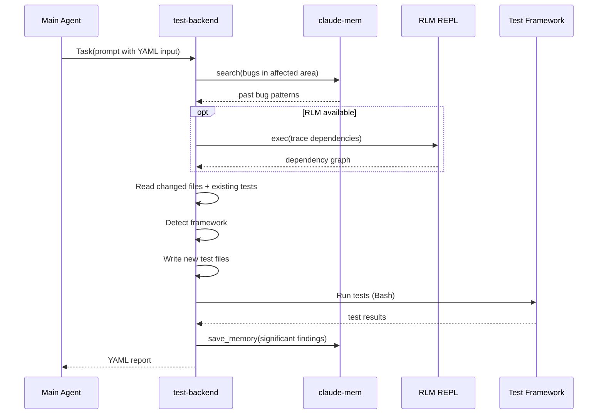
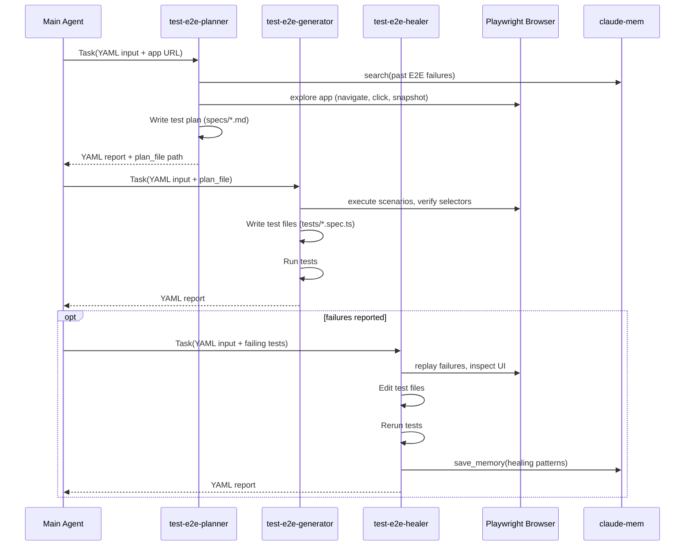

# Testing Subagent Subsystem - Technical Design Document

## Reference Documents

- **PRD**: [002-TEST-SUBSYSTEM PRD](2026-02-22-002-TEST-SUBSYSTEM-testing-subagents-prd.md)
- **Existing subagent**: `.claude/agents/rlm-subcall.md` (pattern reference)
- **Playwright agents upstream**:
  `https://github.com/microsoft/playwright/tree/main/packages/playwright/src/agents`

## High-Level Architecture

### System Overview

The testing subsystem is a set of 5 markdown agent definitions in
`.claude/agents/` that the main implementation agent invokes via the
Claude Code Task tool. Each agent runs in an isolated context, receives
structured input, writes and/or runs tests, and returns structured YAML
output.

```
Main Agent (develop/impl)
    │
    ├─► Task(test-backend)     ─► writes + runs unit/integration tests
    │                              returns YAML report
    │
    ├─► Task(test-e2e-planner) ─► explores app, produces test plan
    │       │
    │       ▼
    ├─► Task(test-e2e-generator) ─► converts plan to Playwright tests
    │                                 runs them, returns YAML report
    │
    ├─► Task(test-e2e-healer)  ─► fixes broken E2E tests
    │                              returns YAML report
    │
    └─► Task(test-review)      ─► adversarial gap analysis
                                   returns YAML report with recommendations
```

The main agent decides which subagent(s) to invoke based on changed
files. The test-review agent runs AFTER other test agents to analyze
what they missed.

### Integration Points

- **Claude Code Task tool**: Invocation mechanism for all subagents
- **Claude-mem** (global MCP): All agents query past bugs/patterns at
  start, save findings at end
- **RLM REPL** (optional): Dependency analysis via
  `python3 ~/.claude/rlm_scripts/rlm_repl.py`
- **Playwright MCP** (global): E2E agents use Playwright's browser
  tools for live interaction
- **Test frameworks**: Agents detect and use the project's framework
  (pytest, vitest, jest, go test, etc.)

## Detailed Design

### Agent File Structure

All agents live in `.claude/agents/` alongside `rlm-subcall.md`:

```
.claude/agents/
├── rlm-subcall.md            # existing
├── test-backend.md           # NEW - unit/integration tests
├── test-review.md            # NEW - adversarial gap analysis
├── test-e2e-planner.md       # NEW - forked from Playwright
├── test-e2e-generator.md     # NEW - forked from Playwright
└── test-e2e-healer.md        # NEW - forked from Playwright
```

Installation: `cp .claude/agents/test-*.md ~/.claude/agents/`
(same pattern as existing `rlm-subcall.md`).

### Agent Definitions

#### test-backend.md

```yaml
---
name: test-backend
description: >
  Writes and runs backend unit/integration tests. Detects the
  project's test framework automatically. Use after implementing
  backend features.
model: haiku
tools:
  - Bash
  - Read
  - Write
  - Edit
  - Glob
  - Grep
---
```

**Role**: Backend test specialist. Receives implementation context,
detects test framework, writes tests targeting edge cases and error
paths (not just happy paths), runs them, returns YAML report.

**Key behaviors**:
- Detect framework: scan for pytest.ini, pyproject.toml [tool.pytest],
  vitest.config.*, jest.config.*, go.mod, Cargo.toml
- Read changed files to understand implementation
- Read existing tests to avoid duplication
- Write new test files following project conventions
- Run tests via Bash (pytest, vitest, jest, go test, etc.)
- Query claude-mem for past bugs in affected areas
- Optionally call RLM for dependency chain analysis
- Return standardized YAML report

**Model rationale**: Haiku. Backend test writing is relatively
mechanical — the agent follows patterns from existing tests. The
framework detection and test structure are well-defined. Haiku is
sufficient and cheaper.

#### test-review.md

```yaml
---
name: test-review
description: >
  Adversarial test coverage reviewer. Analyzes implementation code
  and existing tests to find coverage gaps, untested state
  transitions, auth boundaries, and error recovery paths. Does NOT
  write tests — returns recommendations.
model: sonnet
tools:
  - Read
  - Glob
  - Grep
  - Bash
---
```

**Role**: Adversarial analyst. Reads the implementation AND existing
tests, identifies what's NOT tested, reports structured gaps with
severity and recommendations.

**Key behaviors**:
- Read all changed files + their test files
- Analyze state transitions: what state changes happen? Are they
  tested in isolation AND in combination?
- Analyze auth/permission boundaries: can unauthorized access occur?
  Is it tested?
- Analyze error paths: what happens when dependencies fail? Is
  recovery tested?
- Query claude-mem for past bugs in similar code areas
- Optionally call RLM for full dependency graph to find untested
  callers/consumers
- Return YAML report with gaps, severity, and recommendations
- Does NOT write test files (that's the other agents' job)

**Model rationale**: Sonnet. Adversarial analysis requires deeper
reasoning — the agent must understand the implementation's intent
and deliberately look for what's missing. Haiku would produce
shallow gap analysis.

#### test-e2e-planner.md

```yaml
---
name: test-e2e-planner
description: >
  Explores a web application and produces a comprehensive E2E test
  plan in Markdown. Forked from Playwright's official planner agent.
model: sonnet
tools:
  - Bash
  - Read
  - Write
  - Glob
  - Grep
  - playwright-test/browser_click
  - playwright-test/browser_close
  - playwright-test/browser_console_messages
  - playwright-test/browser_drag
  - playwright-test/browser_evaluate
  - playwright-test/browser_file_upload
  - playwright-test/browser_handle_dialog
  - playwright-test/browser_hover
  - playwright-test/browser_navigate
  - playwright-test/browser_navigate_back
  - playwright-test/browser_network_requests
  - playwright-test/browser_press_key
  - playwright-test/browser_run_code
  - playwright-test/browser_select_option
  - playwright-test/browser_snapshot
  - playwright-test/browser_take_screenshot
  - playwright-test/browser_type
  - playwright-test/browser_wait_for
  - playwright-test/planner_setup_page
  - playwright-test/planner_save_plan
---
```

**Upstream source**:
`microsoft/playwright @ packages/playwright/src/agents/playwright-test-planner.agent.md`

**Customizations over upstream**:
1. Added claude-mem queries for past E2E failures in affected areas
2. Added RLM optional enrichment for understanding component
   dependencies
3. Added YAML status output alongside the markdown test plan
4. Added Glob/Grep/Read tools for codebase analysis (upstream
   only has browser + search tools)

**Model rationale**: Sonnet (matches upstream). App exploration and
test plan design requires understanding user flows, edge cases, and
application structure. This is not mechanical work.

#### test-e2e-generator.md

```yaml
---
name: test-e2e-generator
description: >
  Transforms a Markdown test plan into executable Playwright tests.
  Verifies selectors and assertions live. Forked from Playwright's
  official generator agent.
model: sonnet
tools:
  - Bash
  - Read
  - Write
  - Edit
  - Glob
  - Grep
  - playwright-test/browser_click
  - playwright-test/browser_drag
  - playwright-test/browser_evaluate
  - playwright-test/browser_file_upload
  - playwright-test/browser_handle_dialog
  - playwright-test/browser_hover
  - playwright-test/browser_navigate
  - playwright-test/browser_press_key
  - playwright-test/browser_select_option
  - playwright-test/browser_snapshot
  - playwright-test/browser_type
  - playwright-test/browser_verify_element_visible
  - playwright-test/browser_verify_list_visible
  - playwright-test/browser_verify_text_visible
  - playwright-test/browser_verify_value
  - playwright-test/browser_wait_for
  - playwright-test/generator_read_log
  - playwright-test/generator_setup_page
  - playwright-test/generator_write_test
---
```

**Upstream source**:
`microsoft/playwright @ packages/playwright/src/agents/playwright-test-generator.agent.md`

**Customizations over upstream**:
1. Added YAML output report (tests written, pass/fail results)
2. Added claude-mem save for test patterns discovered
3. Added Read/Write/Edit/Glob/Grep tools for codebase context

**Model rationale**: Sonnet (matches upstream). Live selector
verification and code generation require capable reasoning.

#### test-e2e-healer.md

```yaml
---
name: test-e2e-healer
description: >
  Debugs and repairs failing Playwright E2E tests. Replays failures,
  inspects current UI state, patches tests. Forked from Playwright's
  official healer agent.
model: sonnet
tools:
  - Bash
  - Read
  - Edit
  - Glob
  - Grep
  - playwright-test/browser_console_messages
  - playwright-test/browser_network_requests
  - playwright-test/browser_snapshot
  - playwright-test/browser_take_screenshot
  - playwright-test/healer_debug_test
  - playwright-test/healer_edit_test
  - playwright-test/healer_run_tests
---
```

**Upstream source**:
`microsoft/playwright @ packages/playwright/src/agents/playwright-test-healer.agent.md`

**Customizations over upstream**:
1. Added YAML output report (tests healed, remaining failures)
2. Added claude-mem query for known UI change patterns
3. Added Read/Glob/Grep for codebase analysis

**Model rationale**: Sonnet (matches upstream). Debugging requires
understanding failure context and reasoning about fixes.

### YAML Input Contract

The main agent passes context to test subagents via the Task tool
prompt. The following YAML structure is embedded in the prompt text:

```yaml
# --- TEST SUBAGENT INPUT ---
task_description: |
  User story or task being tested. Copied from the task list.
changed_files:
  - src/api/auth.py
  - src/models/user.py
  - src/components/AdminPanel.vue
key_patterns:
  - auth/session management
  - role-based access control
  - admin panel navigation
test_framework: pytest          # auto-detected or specified
e2e_framework: playwright       # for E2E agents only
existing_tests:
  - tests/test_auth.py
  - tests/e2e/test_admin.spec.ts
rlm_available: true             # optional enrichment flag
project_name: my-project        # for claude-mem queries
# --- END INPUT ---
```

The main agent constructs this from:
- The current task description (from task list)
- `git diff --name-only` for changed files
- Its own analysis of key patterns touched
- Framework detection (or user specification)

### YAML Output Contract

All test subagents return results in this standardized format:

```yaml
# --- TEST SUBAGENT REPORT ---
agent: test-backend             # agent identifier
status: completed               # completed | failed | partial
task: "Backend tests for auth role changes"

tests_written:
  - path: tests/test_role_session.py
    type: integration
    description: "Role change without re-login"
  - path: tests/test_admin_access.py
    type: unit
    description: "Admin endpoint authorization"

tests_run:
  total: 8
  passed: 7
  failed: 1
  errors: 0
  skipped: 0

failures:
  - test: test_role_change_without_relogin
    error: "AssertionError: expected 200 got 403"
    file: tests/test_role_session.py:42
    analysis: |
      Role is updated in DB but session cache retains
      old roles until re-login.

gaps_found:
  - area: auth/session
    description: |
      Role enable takes effect in DB but not in session
      until re-login. No test covers mid-session role
      activation.
    severity: high
    recommendation: "Test role activation without re-login"
  - area: error-recovery
    description: |
      No test for what the user sees when admin endpoint
      returns 403 on a page they navigated to legitimately.
    severity: medium
    recommendation: "Test UI error state on 403 response"

claude_mem_refs:
  - id: 456
    title: "Past session bug in similar auth flow"

new_claude_mem_entries:
  - title: "Auth session cache stale after role update"
    text: "Role changes via PATCH /api/users update DB..."
# --- END REPORT ---
```

**Variations by agent type**:

- **test-review**: No `tests_written` or `tests_run` sections.
  Only `gaps_found` with severity and recommendations.
- **test-e2e-planner**: No `tests_run`. Instead includes
  `plan_file: specs/admin-flow.md` with the generated test plan.
- **test-e2e-generator**: Full report. `tests_written` contains
  the generated spec files.
- **test-e2e-healer**: Adds `tests_healed` section listing which
  tests were fixed and how.

### Claude-Mem Integration

All agents follow this pattern:

**At start** (before doing any work):
```
mcp__plugin_claude-mem_mcp-search__search(
  query="bugs failures <affected_area>",
  project="<project_name>",
  limit=5
)
```

Fetch full details for relevant results, use them to inform test
design (target known failure patterns).

**At end** (after completing work):
```
mcp__plugin_claude-mem_mcp-search__save_memory(
  text="[TYPE: TEST-FINDING]\n<finding details>",
  title="<area> - <finding summary>",
  project="<project_name>"
)
```

Save only significant findings: new bugs discovered, non-obvious
coverage gaps, pattern violations. Do not save routine "all tests
passed" results.

### RLM Optional Enrichment

When `rlm_available: true` in input, agents MAY call:

```bash
python3 ~/.claude/rlm_scripts/rlm_repl.py exec <<'PY'
# Trace dependencies of changed files
changed = ['src/api/auth.py', 'src/models/user.py']
for f in changed:
    deps = get_dependents(f)
    print(f"{f} is used by: {deps}")
PY
```

This reveals additional code paths to test (callers, consumers,
related modules) that the main agent's handoff may not mention.

Agents MUST work without RLM. If `rlm_available` is false or RLM
calls fail, agents proceed with the provided context only.

### Framework Auto-Detection

Backend test agent detects framework by checking (in order):

| Check | Framework |
|-------|-----------|
| `pytest.ini` or `pyproject.toml [tool.pytest]` | pytest |
| `vitest.config.*` | vitest |
| `jest.config.*` or `package.json "jest"` | jest |
| `go.mod` + `*_test.go` files | go test |
| `Cargo.toml` + `#[cfg(test)]` | cargo test |
| `phpunit.xml` | phpunit |

E2E agents check for:
| Check | Framework |
|-------|-----------|
| `playwright.config.*` | Playwright |
| `cypress.config.*` | Cypress (future) |

If no framework detected, agent reports in YAML:
```yaml
status: failed
error: "No test framework detected. Install a test framework first."
```

### Invocation Flow

The main agent (during `/impl` or manually) follows this sequence:

```
1. Implementation complete
2. Collect context:
   - git diff --name-only → changed_files
   - Analyze changed files → key_patterns
   - Detect test framework
   - Build YAML input
3. Decide which agents to call:
   - Backend files changed? → test-backend
   - Frontend files changed? → test-e2e-planner → test-e2e-generator
   - Both? → both pipelines
4. Invoke selected agent(s) via Task tool
5. Parse YAML output
6. If gaps_found with severity=high:
   - Add to task list as new subtasks
   - Or implement fixes immediately (user decides)
7. Optionally invoke test-review for adversarial analysis
8. Report summary to user
```

**E2E pipeline** (sequential, not parallel):
```
test-e2e-planner
    │ produces: specs/feature-name.md
    ▼
test-e2e-generator
    │ produces: tests/feature-name.spec.ts + YAML report
    ▼
test-e2e-healer (only if generator reports failures)
    │ produces: fixed tests + YAML report
```

**Backend + review** (backend first, then review):
```
test-backend
    │ produces: test files + YAML report
    ▼
test-review (analyzes implementation + all tests)
    │ produces: gap report only
```

### Playwright Fork Management

Each E2E agent file includes a header block:

```markdown
<!-- UPSTREAM SOURCE -->
<!-- repo: microsoft/playwright -->
<!-- path: packages/playwright/src/agents/ -->
<!-- file: playwright-test-planner.agent.md -->
<!-- fetched: 2026-02-22 -->
<!-- To update: npx playwright init-agents --loop=claude -->
<!-- then merge changes into this file -->
<!-- CUSTOMIZATIONS below are marked with # CUSTOM comments -->
<!-- END UPSTREAM SOURCE -->
```

**Update procedure**:
1. Download latest agent `.md` files from GitHub:
   `https://github.com/microsoft/playwright/tree/main/packages/playwright/src/agents/`
   Files: `playwright-test-planner.agent.md`,
   `playwright-test-generator.agent.md`,
   `playwright-test-healer.agent.md`
2. Diff downloaded files against our copies
3. Merge upstream changes, preserving lines marked `# CUSTOM`
4. Update `fetched` date in header

### Error Handling

| Scenario | Agent behavior |
|----------|---------------|
| No test framework found | Return `status: failed` with clear error |
| Claude-mem unavailable | Skip memory queries, proceed with context |
| RLM not initialized | Skip dependency analysis, proceed |
| Playwright not installed | E2E agents return `status: failed` |
| Tests fail to run (syntax) | Return `status: partial` with error details |
| All tests pass, no gaps | Return `status: completed`, empty gaps |

Agents never hang or fail silently. Every exit path produces a
valid YAML report.

## Sequence Diagrams

### Backend Test Delegation



### E2E Test Pipeline



## Performance, Scalability, and Reliability

### Performance

- **test-backend** (Haiku): Fastest. Expected 1-3 minutes for
  typical feature. Mechanical work, small model.
- **test-review** (Sonnet): 2-5 minutes. Analysis-heavy but no
  test execution.
- **E2E pipeline** (Sonnet x3): 5-15 minutes total. Browser
  interaction is the bottleneck, not model inference.
- **Parallel execution**: Backend and E2E pipelines can run in
  parallel (they're independent). Review runs after both complete.

### Token Cost Estimates

| Agent | Model | Estimated tokens | Estimated cost |
|-------|-------|-----------------|----------------|
| test-backend | Haiku | 10-30K | ~$0.01-0.03 |
| test-review | Sonnet | 20-50K | ~$0.10-0.25 |
| test-e2e-planner | Sonnet | 30-60K | ~$0.15-0.30 |
| test-e2e-generator | Sonnet | 40-80K | ~$0.20-0.40 |
| test-e2e-healer | Sonnet | 20-40K | ~$0.10-0.20 |
| **Full pipeline** | **Mixed** | **120-260K** | **~$0.56-1.18** |

Offset: main agent saves ~30-60K tokens by not doing test work
in its own context.

### Reliability

- **Graceful degradation**: Each dependency (claude-mem, RLM,
  Playwright) is optional. Agents degrade in capability but
  never fail to produce a YAML report.
- **Consistent output**: Every execution path ends with a valid
  YAML report. The main agent can always parse the result.
- **No worktree by default**: Tests are written directly in the
  working tree. The main agent can request worktree isolation
  via `isolation: "worktree"` in the Task call when needed.

## Clarified Decisions (from discussion)

- **Sequential execution**: Backend and E2E pipelines run
  sequentially (system is not mature enough for parallel yet).
  Can be revisited later.
- **Zero-tests scenario not applicable**: test-review always runs
  after test-backend or test-e2e-generator, which create tests.
  The /impl flow ensures tests exist before review.
- **Playwright source**: Agent .md files are downloaded directly
  from the GitHub repo (raw markdown), not via `npx` CLI.
  No Node.js dependency needed for the fork itself.
