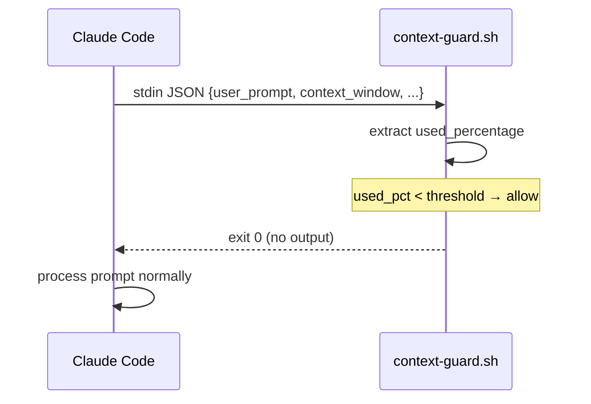
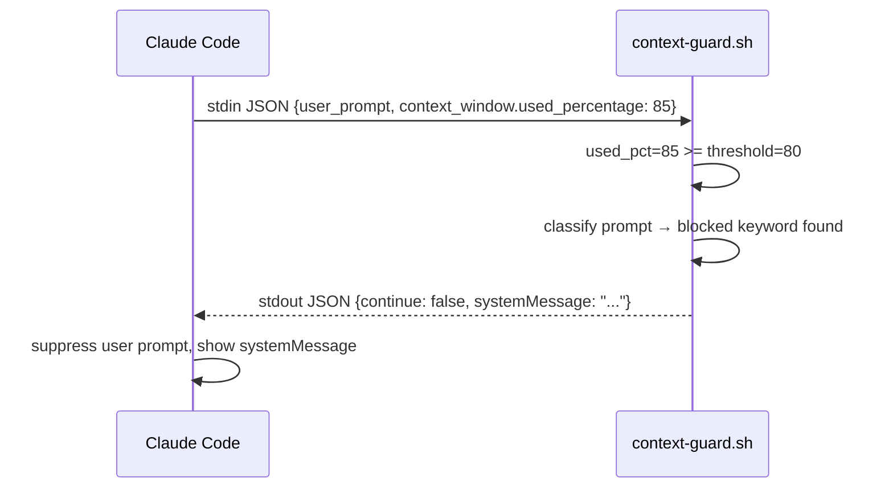
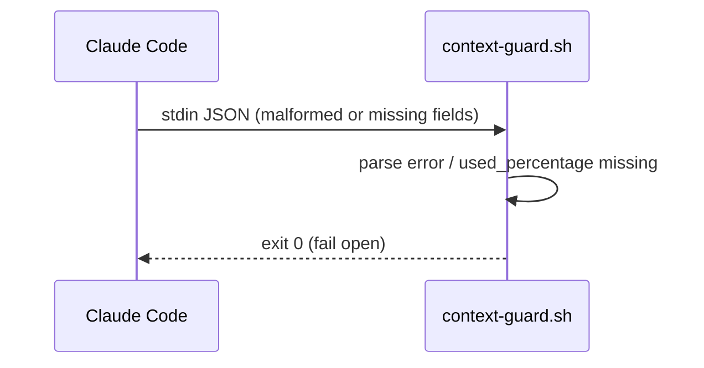

# Context Guard - Technical Design Document

## Reference Documents
- **PRD**: [2026-03-08-004-CONTEXT-GUARD-prd.md](
  2026-03-08-004-CONTEXT-GUARD-prd.md)

## High-Level Architecture

### System Overview

A single bash script registered as a `UserPromptSubmit` hook in
`~/.claude/settings.json`. On every user prompt, Claude Code runs the
script, passing hook context via stdin JSON. The script reads
`context_window.used_percentage` directly from stdin, classifies the
prompt, and either exits 0 (allow) or outputs a JSON block response
(deny).

No transcript parsing, no temp files, no network calls.

### Component Diagram

```
UserPromptSubmit event
        │
        ▼
┌───────────────────┐
│  context-guard.sh │  Bash script — the only component
│                   │
│  1. Parse stdin   │  ← JSON: user_prompt,
│  2. Read usage %  │         context_window.used_percentage,
│  3. Check threshold│        context_window.context_window_size
│  4. Classify prompt│  ← keyword blocklist on user_prompt
│  5. Allow / Block │  → exit 0 (allow) or JSON to stdout (block)
└───────────────────┘
```

### Hook Stdin Schema (UserPromptSubmit)

The actual stdin JSON for `UserPromptSubmit` command hooks:

```json
{
  "session_id": "...",
  "transcript_path": "/Users/.../.claude/projects/.../session.jsonl",
  "cwd": "/path/to/project",
  "permission_mode": "acceptEdits",
  "hook_event_name": "UserPromptSubmit",
  "prompt": "implement story 2.1"
}
```

Note: the prompt field is `"prompt"`, not `"user_prompt"`. There is
no `context_window` object in the hook stdin — context usage must be
derived from the transcript file at `transcript_path`.

### Integration Points

- **Claude Code hook system**: `UserPromptSubmit` command hook.
  Prompt text comes from stdin `"prompt"` field.
- **Session transcript** (`transcript_path`): JSONL file containing
  assistant entries with token usage. The last assistant entry's
  token counts are used to compute context fill %.

## Detailed Design

### Sequence Diagrams

#### Happy path — below threshold



#### Block path — above threshold, dev keyword matched



#### Fail-open path — stdin unreadable or malformed



### System Components

#### context-guard.sh

**Responsibilities:**
- Parse stdin JSON using `python3 -c` (no `jq` dependency; Python
  is already required for RLM)
- Extract `context_window.used_percentage` and `user_prompt`
- Extract `context_window.context_window_size` for the block message
- Compare `used_percentage` against `CONTEXT_GUARD_THRESHOLD` env
  var (default: 80)
- If below threshold → `exit 0`
- Classify `user_prompt` against keyword blocklist
- If classified as dev work → output block JSON to stdout
- On any error → `exit 0` (fail open)

**Request classification:**

Blocklist approach: block if `user_prompt` (lowercased) matches any
of these patterns:

```
implement, code, build, create, write, develop, add feature,
start story, begin story, start task, begin task, refactor,
fix bug, debug
```

Everything not matching the blocklist is allowed. This minimizes
false positives on safe operations (`/start`, `/check`, `commit`,
`update docs`, `save`, `search`, `mark`, `task list`).

`override:` prefix escape hatch: if `user_prompt` starts with
`override:` (case-insensitive), skip classification and allow.

**Block response format:**

```json
{
  "decision": "block",
  "reason": "Context is {N}% full (threshold: {T}%, window: {W}k).
Start a fresh session for new development. Allowed now: update docs,
tasks, claude-mem, or commit."
}
```

### State Management

The script is stateless. It reads stdin on each invocation and
discards all data after exit. No caching, no persistent variables,
no temp files.

## Performance and Reliability

### Performance

- Single `python3` subprocess for stdin parsing: ~100 ms.
- No file I/O beyond stdin read.
- Total hook latency well under the 2-second PRD requirement.

### Reliability

- **Fail open on all errors**: top-level `trap 'exit 0' ERR` ensures
  any uncaught error exits 0.
- **Malformed stdin**: if Python can't parse stdin JSON,
  `used_percentage` is unavailable → fail open.
- **Missing `used_percentage`**: treated as 0 → below any threshold
  → fail open.

## Installation Contract

The script ships at `.claude/hooks/context-guard.sh` in this repo.
Users copy it to `~/.claude/hooks/` and add to
`~/.claude/settings.json`:

```json
{
  "hooks": {
    "UserPromptSubmit": [
      {
        "hooks": [
          {
            "type": "command",
            "command": "bash ~/.claude/hooks/context-guard.sh"
          }
        ]
      }
    ]
  }
}
```

Installation instructions belong in README, not here.

## Open Questions

- **Blocklist completeness**: the current keyword list may need
  tuning after real-world use. False positives (blocking safe ops)
  are worse than false negatives (missing a dev request).
