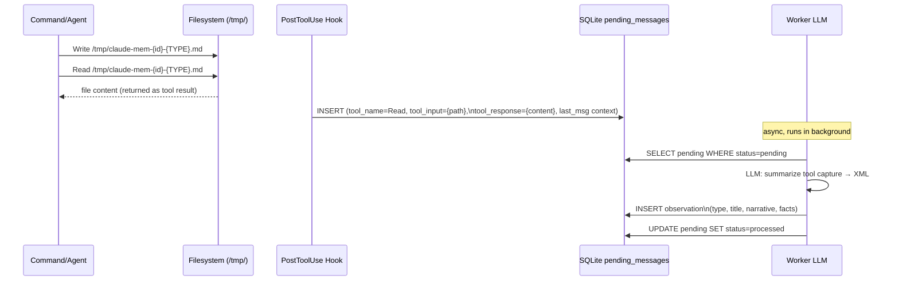
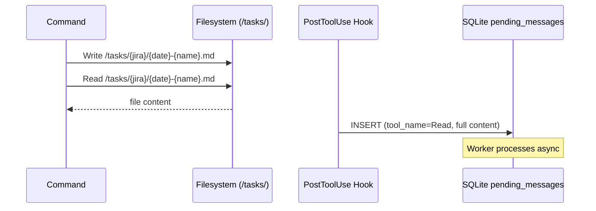

# 005-FIX-SAVE-MEMORY - Technical Design Document

## Reference Documents
- **PRD**: [2026-03-11-005-FIX-SAVE-MEMORY-prd.md](
  2026-03-11-005-FIX-SAVE-MEMORY-prd.md)

## High-Level Architecture

### System Overview

This feature replaces all `save_memory` MCP tool calls (which don't
exist in claude-mem v10.5.2) with a write+read pattern that works
with the plugin's actual persistence mechanism: a PostToolUse hook
that enqueues every tool call, which the worker service then processes
via LLM into structured observations.

The key constraint discovered during investigation: the worker does NOT
parse `[TYPE:]`/`[JIRA:]` tags from file content. Instead, it runs an
LLM over the raw tool capture (tool_name + tool_input + tool_response)
and extracts structured XML fields (`<type>`, `<title>`, `<narrative>`,
`<facts>`, etc.). Our `[TYPE:]` tags therefore serve as **context hints**
for the LLM summarizer, not as structured metadata directly.

### Data Flow: How Observations Are Created

```
Command writes file
        │
        ▼
Command Reads file  ──→  PostToolUse hook fires
                                │
                                ▼
                    pending_messages (SQLite)
                    { tool_name, tool_input,
                      tool_response (full file content),
                      last_assistant_message,
                      last_user_message }
                                │
                                ▼
                    Worker LLM summarizer
                    (processes batches of pending msgs)
                                │
                                ▼
                    XML parsed into observation fields:
                    <type>, <title>, <subtitle>,
                    <narrative>, <facts>, <concepts>
                                │
                                ▼
                    Observations table (searchable)
```

### What the `[TYPE:]` Tags Actually Do

They are NOT parsed by the worker directly. They appear in
`tool_response` (file content), which feeds the LLM summarizer prompt.
The LLM reads the content including tags like `[TYPE: PRD]` as
**semantic signals** that help it produce a well-typed observation.
The `type` field in the XML output must match one of the `observation_types`
defined in the active claude-mem mode. Unknown types fall back to the
mode's default type.

### Files Requiring Changes

| Tree | Files with save_memory | Location |
|------|------------------------|----------|
| `rlm-mem/` | `init`, `prd`, `tech-design`, `tasks`, `check`, `impl`, `save`, `README` | repo `.claude/commands/rlm-mem/` |
| `coding/` | `init`, `prd`, `tech-design`, `tasks`, `check`, `save`, `pr-review` | `~/.claude/commands/coding/` |
| agents | `test-backend`, `test-review`, `test-e2e-planner`, `test-e2e-generator`, `test-e2e-healer` | repo `.claude/agents/` |
| `rlm/` | **none** — uses ai-docs/ only | skip |

Note: `coding/` tree files live in `~/.claude/` (installed), not in
this repo. They have independent implementations, not copies of
`rlm-mem/`. They need to be patched in place at `~/.claude/`.

## Detailed Design

### The Two Replacement Patterns

Every `save_memory` call falls into one of two categories:

#### Pattern A — File Artifact Commands

Commands that already write a `.md` file to disk (PRD, tech-design,
tasks, init overview). The observation is created by Reading the output
file immediately after writing it.

**Before:**
```
Write output file to /tasks/…
save_memory(text=full_content, title=…, project=…)
```

**After:**
```
Write output file to /tasks/…
Read the output file   ← PostToolUse hook captures full content
(no save_memory call)
```

The instruction to Claude in the command file changes from:
```
Use MCP tool `mcp__plugin_claude-mem_mcp-search__save_memory`(...)
```
to:
```
Read the file you just created. This triggers the claude-mem
PostToolUse hook which automatically captures the content as
an observation. No explicit save step is needed.
```

#### Pattern B — Ephemeral Content Commands

Commands that save content with no corresponding on-disk file
(session decisions in `develop:save`, implementation completions
in `develop:impl`, task completions in `plan:check`, test findings
in agents).

**Before:**
```
save_memory(text=decision_text, title=…, project=…)
```

**After:**
```
Write to /tmp/claude-mem-<TYPE>-<epoch>.md:
  # <human-readable title>

  [TYPE: <TYPE>]
  [PROJECT: <project>]

  <content>

Read /tmp/claude-mem-<TYPE>-<epoch>.md
```

The temp file write + Read triggers the hook. The `# Title` H1 line
feeds the LLM summarizer so it can produce a meaningful `<title>` in
the XML output. Temp files are not cleaned up — `/tmp/` is OS-managed.

### Epoch Timestamp Generation

Commands are markdown files executed by Claude. Claude cannot call
`date` or shell commands inline. The epoch timestamp in the filename
must use a Bash tool call or be approximated with a fixed format.

**Decision**: Use Bash to generate the filename:
```bash
echo /tmp/claude-mem-<TYPE>-$(date +%s).md
```

Or simpler — instruct the command to use the session's current context
(jira_id + type) as a unique-enough filename:
```
/tmp/claude-mem-<jira_id>-<TYPE>.md
```

This avoids a Bash call entirely and is unique per session per type.
For agents (no jira_id), use:
```
/tmp/claude-mem-<agent_name>-<TYPE>.md
```

**Chosen approach**: `jira_id + TYPE` suffix for commands,
`agent_name + TYPE` suffix for agents. No Bash call needed.

### Per-File Change Specifications

#### `discover/init.md` (7 calls → Pattern A + B)

The init command reads and indexes multiple existing files. It's the
most complex case.

| Original call | Content type | Pattern | Replacement |
|---------------|-------------|---------|-------------|
| Project overview (README + CLAUDE.md) | Synthesized | B | Write summary to `/tmp/claude-mem-<proj>-PROJECT-OVERVIEW.md`, then Read it |
| RLM codebase analysis | Synthesized | B | Write analysis to `/tmp/claude-mem-<proj>-CODEBASE-ANALYSIS.md`, then Read it |
| PRD files (`*-prd.md`) | Existing file | A | Read each file directly |
| Tech-design files (`*-tech-design.md`) | Existing file | A | Read each file directly |
| Task-list files (`*-tasks.md`) | Existing file | A | Read each file directly |
| Review files (`*-review.md`) | Existing file | A | Read each file directly |
| Config files (package.json etc.) | Synthesized | B | Write config summary to `/tmp/claude-mem-<proj>-PROJECT-CONFIG.md`, then Read it |

**Net change**: Remove 7 `save_memory` calls. For existing files: just
Read them (already captured by hook). For synthesized content: Write
to temp file, then Read.

#### `plan/prd.md`, `plan/tech-design.md`, `plan/tasks.md` (Pattern A)

These commands already write a file to `/tasks/`. The step that calls
`save_memory` immediately follows. Replace with:

```
## Final Instructions
...
2. **Seed claude-mem**: Read the file you just created. The PostToolUse
   hook captures the full content automatically — no explicit save
   step is needed.
```

The `save_memory` code block is removed entirely.

#### `develop/impl.md`, `plan/check.md` (Pattern B)

These save implementation completion records with no on-disk artifact.
Replace with:

```
**Persist to claude-mem:**
Write the following to `/tmp/claude-mem-{jira_id}-IMPLEMENTATION.md`
(or TASK-COMPLETION for check.md):

# {jira_id} - {task_name} Implementation

[TYPE: IMPLEMENTATION]
[PROJECT: {project_name}]

Task '{task_name}' complete.

Patterns used:
{patterns}

Files:
{files}

Then Read `/tmp/claude-mem-{jira_id}-IMPLEMENTATION.md`.
```

#### `develop/save.md` (Pattern B)

The save command persists multiple decisions. Each distinct decision
gets its own temp file (to produce separate observations with distinct
titles), or they can be batched into one if the command determines
they form a single logical unit. The command currently calls
`save_memory` once per decision — preserve one-per-decision to maintain
the same granularity:

```
For each decision not yet in claude-mem:
  Write to `/tmp/claude-mem-{jira_id}-SESSION-DECISION-{n}.md`:
    # {jira_id} - {short_description}

    [TYPE: SESSION-DECISION]
    [PROJECT: {project_name}]

    {decision text}

  Read `/tmp/claude-mem-{jira_id}-SESSION-DECISION-{n}.md`
```

Where `{n}` is 1, 2, 3 etc. for multiple decisions in one session.

#### Test agents (Pattern B, 5 agents)

Each agent saves test findings. Replace with the same temp-file pattern.
Since agents have no jira_id, use agent name + a short slug from the
finding:

```
Write to `/tmp/claude-mem-test-backend-TEST-FINDING.md`:
  # {area} - {finding summary}

  [TYPE: TEST-FINDING]
  [PROJECT: {project_name}]

  {finding details}

Read `/tmp/claude-mem-test-backend-TEST-FINDING.md`
```

The "if available" guard stays identical — the write+read replaces only
the `save_memory` call, not the surrounding if-available logic.

### README and CLAUDE.md Updates

`rlm-mem/README.md` lists `save_memory` as an available MCP tool.
Remove it from the list. Add a note:

```
**Note:** Writing to claude-mem is automatic via PostToolUse hook.
Commands use `Read` on output files to trigger capture. No explicit
save API is available in v10.5.2.
```

`CLAUDE.md` (repo root) does not currently mention `save_memory`
explicitly — no change needed unless audit finds otherwise.

### Sequence Diagram: Pattern B (Ephemeral Save)



### Sequence Diagram: Pattern A (File Artifact)



## Data Considerations

### Observation Type Mapping

The LLM summarizer must output a `<type>` that matches the claude-mem
mode's `observation_types`. The `[TYPE:]` tag in our content is a hint
to the LLM, not a parsed value. If the active mode doesn't include
`IMPLEMENTATION` as a type, the worker falls back to the default type.

We do not control the mode's observation_types. Our `[TYPE:]` tags
must match what the mode defines, or the worker silently reclassifies.
This is existing behavior — `save_memory` had the same constraint on
its `type` parameter.

**Risk**: If the mode only has generic types (e.g., `note`, `decision`),
`[TYPE: PRD]` in the content is just a hint; the worker may map it to
`note`. The search still works semantically; only the type label differs.

This is acceptable — the PRD accepts observation quality parity with
the old `save_memory` approach.

### temp file naming: collision risk

`/tmp/claude-mem-{jira_id}-{TYPE}.md` is unique per project per type
per session. Multiple parallel sessions on the same project could
collide. This is negligible in the Claude Code use case (single user,
sequential sessions). If needed, append PID: `$(echo $$)` in Bash,
but this adds complexity. Omit for now.

## Open Questions (Resolved)

1. **Does the worker parse `[TYPE:]` tags?** No — it uses LLM + XML.
   `[TYPE:]` tags act as LLM hints only. This is sufficient.

2. **Does the `rlm/` tree need patching?** No — it uses ai-docs/ with
   no save_memory calls.

3. **Should `rlm-mem/README.md` remove `save_memory` from tool list?**
   Yes — it's factually wrong documentation. Remove in this feature.

4. **Where do `coding/` tree files live?** In `~/.claude/commands/coding/`
   (installed, not in this repo). They must be patched in place using
   the Edit tool during implementation. The `install.sh` script does not
   cover them (it copies from this repo TO `~/.claude/`, but `coding/`
   files are managed separately).

## Implementation Order

Recommended sequence to minimize rework:

1. **rlm-mem/discover/init.md** — most complex, sets the pattern
2. **rlm-mem/plan/prd.md**, **tech-design.md**, **tasks.md** — Pattern A,
   simple removals
3. **rlm-mem/plan/check.md**, **develop/impl.md** — Pattern B, ephemeral
4. **rlm-mem/develop/save.md** — Pattern B, multi-decision
5. **rlm-mem/README.md** — doc update, remove save_memory from tool list
6. **~/.claude/commands/coding/** — mirror same changes (7 files)
7. **.claude/agents/** — 5 test agents, Pattern B findings

Total: ~19 files changed.

## Rejected Alternatives

**Alternative 1: Add save_memory to the MCP server**
Rejected — modifying the claude-mem plugin is out of scope and would
break on plugin updates.

**Alternative 2: Use Bash to call the worker service directly**
Rejected — the worker service is a private internal API with no
documented CLI interface. Coupling to it would be fragile.

**Alternative 3: Write only to temp file, skip Read**
Rejected — the hook fires on Read, not Write. A Write without a
subsequent Read produces no hook event and no observation.

**Alternative 4: Single large init file with all content**
Rejected — separate Read calls produce separate observations, which
match the original intent of separate `save_memory` calls (distinct
titles, distinct search results).
